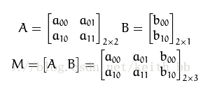

# 图像几何处理


## 预备知识

### 笛卡尔坐标

在数学里，笛卡尔坐标系 (Cartesian coordinate system)，亦称直角坐标系，是一种正交坐标系。二维的直角坐标系是由两条相互垂直、相交于原点的数线构成的。在平面内，任何一点的坐标是根据数轴上对应的点的坐标设定的。

常用坐标即为二维坐标系，常用于欧氏空间


### 齐次坐标

在欧氏空间（几何学）中，同一平面上的两条平行线不能相交，或者说不能永远相交。这是一个大家都熟悉的常识。

但是，在投影空间中就不一样了，比如，下图上的火车铁路在远离眼睛的时候会变得更窄。最后，两条平行的铁轨在地平线处相交，也就是无限远处的一点。


欧式空间无法描述投影空间，在无穷远处欧氏空间的平行线不会相交

为了解决这个问题，我引入齐次坐标，在笛卡尔坐标中多引入一个参数w

#### 坐标转换

两个坐标之间的相互转换：


还有一个有意思的现象就是(1,2,3),(2,4,6),(3,6,9)都对应于(1/3,2/3),这两个点是齐次的，在齐次坐标中不同的点可能是笛卡尔坐标中相同的点

一个齐次坐标乘以一个非零的标量，得到的点依旧对应于笛卡尔坐标中相同的点


齐次坐标变换的实质就是矩阵的变换


#### 齐次坐标的应用

齐次坐标在计算机图形学中是非常有用的基本概念，通过增加一个额外的维度W后，可以用来对几何体进行缩放,旋转,平移,透视投影的矩阵变换

而当W=0时，这个坐标表示无限长的一个向量，通常表示N-1维的矢量。


## 几何变换

### 线性变换

Linear Transformations

#### 理论函数

Conformal mapping

也叫保角变换，它保持了角度以及无穷小物体的形状，但是不一定保持它们的尺寸。更通俗地说，如果原图像中两条直线垂直（或平行或某个夹角），那么在经过共形映射之后的图像中这两条直线也垂直（或平行或某个夹角）。


仿射变换是指在向量空间中进行一次线性变换(乘以一个矩阵)并加上一个平移(加上一个向量)，变换为另一个向量空间的过程。



由于使用矩阵A和对二维向量进行变换，所以也可以换成以下形式


最终得到如下结果


变换函数：

```python
dst = cv2.warpAffine(src,M,dsize)
```

- dst ： 输出图像
- src ： 原图像
- M : 对应转换矩阵
- dsize : 输出图像的大小,为元组的形式


#### 使用矩阵

**图像平移：**


**图像翻转：**

水平翻转


垂直翻转：


**图像旋转**：


### 投影变换

透视变换(Perspective Transformation)是将图片投影到一个新的视平面(Viewing Plane)，也称作投影映射(Projective Mapping)。通用的变换公式为：


u,v是原始图片左边，对应得到变换后的图片坐标x,y

我们通过两次变换：四边形变换到正方形+正方形变换到四边形就可以将任意一个四边形变换到另一个四边形。


### 非线性变换

多项式映射是利用多项式对原始图像的映射。

例如二阶变换的方程式是：


将其写成变换矩阵，则会变为:


a1,a2,a3等都是待定系数，待定系数的数量是由变换方程的最大阶数决定的,假设阶数为n，则待定系数数量t为:


