## 图像阈值

进行图像阈值处理主要的使用图像是二值图。

例如如果需要讲灰度图转换为二值图，比如我们感兴趣的区域灰度在[128,256]，不感兴趣的的范围灰度值在[0,127]，此时我们可以将[127,256]范围转换为白色(逻辑1)，将[0，126]转换为黑色(逻辑0)。而阈值的设定就是用于区分逻辑1与逻辑0之间的界限。

### 简单阈值

直接设定阈值用于判断，使用内置函数cv2.threshold

```python
ret,dst = cv2.threshold(src, thresh, maxval, type[, dst])
```

- ret : 判断二值化是否成功 布尔类
- dst : 二值化后输出的图像
- src : 灰度图源
- thresh ： 设定的阈值
- maxval ： 如果超过阈值会被设置为maxvam，一般为255（逻辑1）
- type ： 二值化操作类型，一共分为五种，接下来会一一展示

#### cv.THRESH_BINARY


这个很好理解，由上图可知超过阈值就会被设置为maxval

```python
ret,thresh = cv.threshold(grey,127,255,cv.THRESH_BINARY)
```

**图像显示的代码（方便需要使用的同学）：**

```python
ret,thresh = cv.threshold(grey,127,255,cv.THRESH_BINARY)

#图像显示
plt.figure(figsize = (10,10))
plt.subplot(121);plt.imshow(grey,cmap='gray');plt.title('origial')
plt.subplot(122);plt.imshow(thresh,cmap='gray');plt.title('THRESH_BINARY')
plt.show()
```

这里注意一下opencv使用的是BGR模式，而matlibplot使用的RGB模式，二者正好相反，使用的时候需要注意通道。

这里的cmap='gray'是matplotlib用于处理灰度图时使用的,如果不添加则会显示一张绿油油的"伪灰度图"。

**运行结果为：**

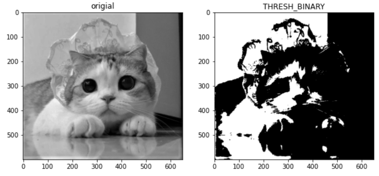

#### cv2.THRESH_BINARY_INV	


显而易见，这一种类型和THRESH刚好相反（毕竟inv表示invert的意思嘛）

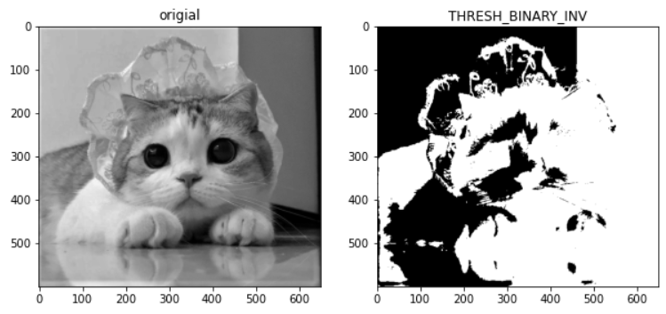

一般来说追踪深色物体需要使用该类型（二值化后白色表示感兴趣的区域）

#### cv2.THRESH_TRUNC


这个方法的意思是，当像素值大于阈值时，将该像素设置为阈值（注意是阈值，而不知maxval）

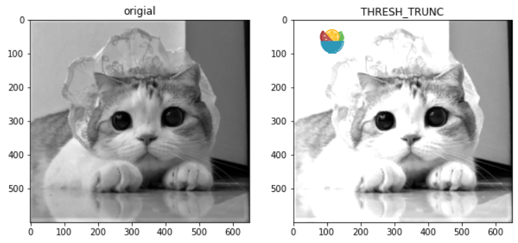

这样看就有一点类似于相机过曝的效果了，可以看到深色的区域还是保持不变的，只有偏白的区域变得更加白了

#### cv2.THRESH_TOZERO


这个类型的作用是，大于阈值部分的像素点灰度值不改变，其他像素点灰度变为逻辑0

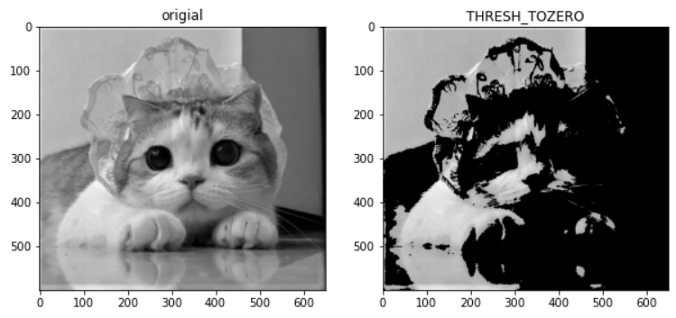

#### cv2.THRESH_TOZERO_INV


这个方法和TOZERO刚好相反，大于阈值的部分灰度值变为0，其余灰度值保持不变

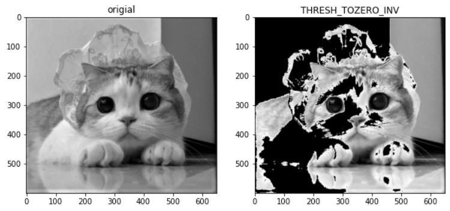


### 自适应阈值

很多情况下我们并不能提前预估好图像的阈值，或者对同一张图像的不同部分使用相同阈值进行处理这也是不合理的，有可能会使本来感兴趣的区域被阈值筛掉。

使用自适应阈值能够根据不同于区域选择合适的阈值进行处理。自适应阈值使用adaptiveThreshold函数

```python
dst = cv.AdaptiveThreshold(src, dst, maxValue, adaptive_method, thresholdType, blockSize=3, param1=5)
```

- adaptive_method:自适应方法,一共有两种类
  - cv.ADAPTIVE_THRESH_MEAN_C 领域内进行计算
  - cv.ADAPTIVE_THRESH_GAUSSIAN_C 领域内像素点进行加权和
- thresholdType: 阈值类型 只有两种了
  - THRESH_BINARY
  - THRESH_BINARY_INV
- blockSize:规定每个自适应区域的大小
- C:常数，最后的阈值等于指定正方形区域的均值减C

```python
thresh1 = cv.adaptiveThreshold(grey,255,cv.ADAPTIVE_THRESH_GAUSSIAN_C,cv.THRESH_BINARY,11,2)
thresh2 = cv.adaptiveThreshold(grey,255,cv.ADAPTIVE_THRESH_MEAN_C,cv.THRESH_BINARY,11,2)

#图像显示
plt.figure(figsize = (10,10))
plt.subplot(121);plt.imshow(thresh1,cmap='gray');plt.title('adaptive_thresh_gaussian_c')
plt.subplot(122);plt.imshow(thresh2,cmap='gray');plt.title('adaptive_thresh_mean_c')
plt.show()
```

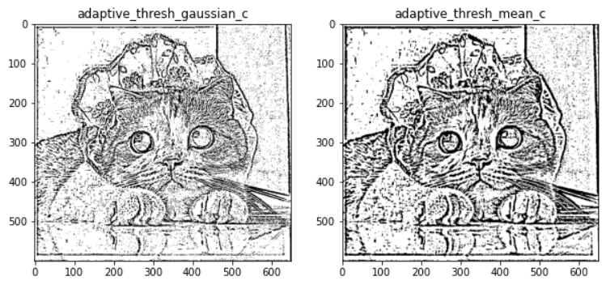


### Otsu's 二值化（大津算法）

实际处理情况下，人工设置并不是一个很好的方法，所以这里可以使用Otsu's二值化算法，让计算机自己去选择一个合适的阈值

它就是统计各个像素值的出现的次数，然后遍历各种阈值（总共有256种可能的选择），然后让被划分的那两类的像素值的方差的加权和最小。加权和的权重就是对应类中像素值之和。这个方差就用统计学中的方差计算公式即可。

使用方法就是在参数type后面加上cv2.THRESH_OTSU

```python
ret,thresh = cv.threshold(grey,0,255,cv.THRESH_BINARY+cv.THRESH_OTSU)
```

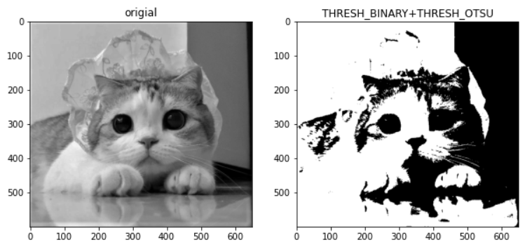

注意thresh必须设置为0才能使用THRESH_OTSU


## 图像去噪

图像的降噪一般使用低通滤波器

需要提前了解的知识：卷积，二维卷积

图像一般存在两种最主要的噪点,椒盐噪点与高斯噪点。

椒盐噪点就是为白色或黑色的点点，是离散的；而高斯噪音一般是连续的，噪音的强度分布符合高斯分布

### filter2D函数

平均滤波是2D滤波的一种特殊形式,2D滤波可以使用任意形式的卷积核进行卷积

```python
cv.Filter2D(src, dst, kernel, anchor=(-1, -1)) 
```

- kernl : 卷积核
- anchor : 内核锚点,默认值为(-1,-1)

```python
kernel = np.ones((5,5),np.float32) / 25
dst = cv.filter2D(img_noise,-1,kernel,anchor=None)
```

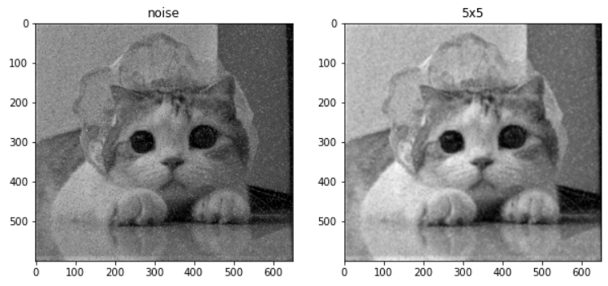


### 平均卷积

平均卷积也是特殊的2D滤波，kernel中默认所有的元素都为1（也就是需要计算周边所有的值），所以只要提供卷积核的边长就好了。这种卷积防止能够较好地处理椒盐噪音。

```python
#平均卷积
dst = cv.blur(src,ksize,anchor=None,borderType=None)
```

### 高斯卷积（高斯模糊）

高斯卷积能够较好地处理高斯噪声，由于高斯噪音具有连续性，所以处理后的图像也会较为柔和、

```python
#高斯模糊
dst = cv.GaussianBlur(src,ksize,sigmaX,sigmaY=None)
```

- sigmaX:高斯函数沿x轴方向的标准差
- sigmaY:高斯函数沿y轴方向的标准差

### 中值滤波

对于椒盐噪声，最好用的方法应该是中值滤波。

中值滤波是通过像素周围的值或者本身的值来取代像素点的值，需要注意：中值滤波卷积核的大小必须为奇数

```python
dst = cv.medianBlur(src,ksize)
```

- ksize : 卷积核的大小，这里只需要传入一个整数就好了

### 双边滤波

这是一种能够保持图像轮廓清晰的同时进行降噪的方法，在卷积的时候会同时考虑像素点和像素点之间的颜色相似度

```python
dst = cv.billateralFilter(src,d,sigmaColor,sigmaSpace)
```

- d: 领域直径
- sigmaColor:灰度值相似性高斯函数标准差
- sigmaSpace:空间高斯函数标准差

有一个非常广泛的引用途径就是美颜滤镜，可以用于去除死皮：

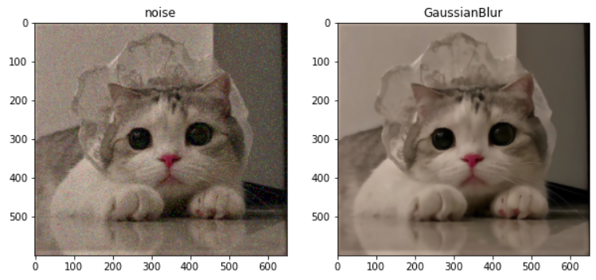


## 形态学转换

### 形态学腐蚀

腐蚀的作用就是将图像中前景物体的轮廓给腐蚀掉,其余部分保持不变。

```python
dst = cv.erode(src,kernel,anchor = None,iterations = None)
```

- anchor: 锚点，默认为（-1,-1）
- iterations：对图像进行形态学腐蚀的次数

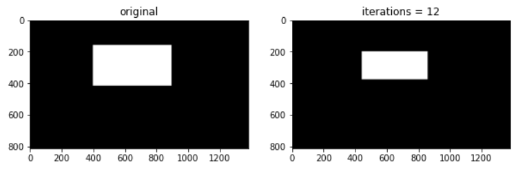

形态学腐蚀可以用于物体的分离

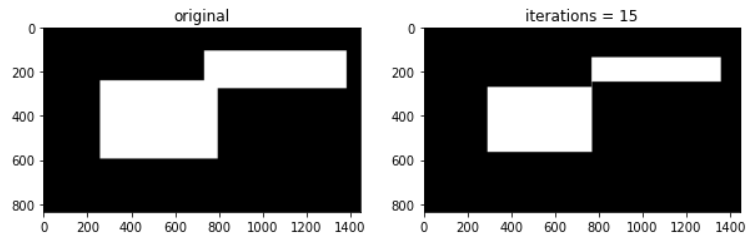

### 形态学膨胀

形态学膨胀与腐蚀的作用正好相反,膨胀的作用可以用于连接两个分开的物体以及修复内部的孔洞

```python
dst = cv.dilate(src,kernel,anchor=None,iterations=None)
```

】


当修复内部空洞时，通常的做法是先形态学**膨胀再腐蚀**，这样在清除外部的噪点的同时修复孔洞。

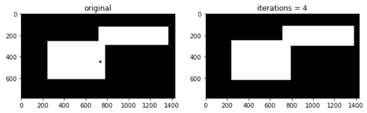

### 形态学高级操作

高级操作是基于形态学膨胀和腐蚀进行的，使用函数mophotoEx

```python
dst = cv.mophotoEx(src,op,kernel,anchor = None,iterations = None)
```

- op:形态学操作的名称，接下来会逐个解释


#### 开闭运算

开运算表示先进行腐蚀再进行膨胀,对应于操作中的cv.MORPH_OPEN

闭运算表示先进性膨胀再进行腐蚀，对应于操作中的cv.MORPH_CLOSE,多用于填补黑点


#### 梯度 礼帽 黑帽

形态学梯度表示形态学膨胀和腐蚀时间的差值

形态学礼帽表示输入图像与进行开运算之后的输出图像之间的差

形态学黑帽表示输入图像与进行闭运算之后的输出图像之间的差

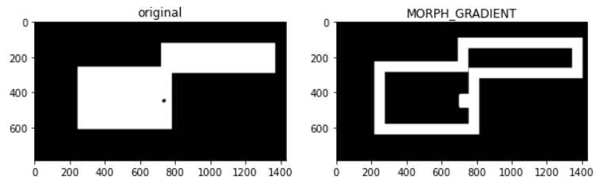

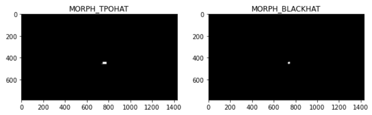

