# Getting of Digital Image

**-----hardware part**

### 像素传感器

**主要原则**：光能在光敏材料上的固定

#### **光电二极管**

将光能转换为电信号输出，由一个简单的PN结构成。

后续介绍的CCD和CMOS都是基于光电二极管进行转换的

**原理：**

创建一个电势井用于捕捉光子，如下图所示：

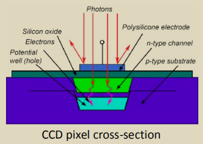

光子一共有三种状态：*弹跳，吸收，耦合*

载流子(电子或电子+空穴对)的存储:p型衬底上n型通道;通道顶部是透明电极(多晶硅);结果在n型沟道下形成势井。落在像素上的光子越多，势阱中累积的电荷就越高。光电流是势阱电荷。光电流读出:顺序移位寄存器将输入端的一串电荷转换为输出端的一串脉冲(模拟信号)。

例如，使用微透镜可以增强感光部分的敏感性：

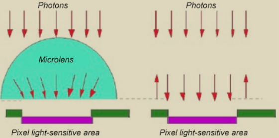

#### **CCD（电荷耦合元件）**

• The signal is read out sequentially from each cell, row by row.

• The next image is possible only when the previous one is already fully 

formed

每一行的每一个像素点和数据都被一次传送到下一个像素中，再由传感器边缘的放大器进行放大输出

ccd的作用就像胶片一样，但它是把光信号转换成电荷信号。ccd上有许多排列整齐的光电二极管，能感应光线，并将光信号转变成电信号，经外部采样放大及模数转换电路转换成数字图像信号。

**优点：**

- 低噪音;

- 高像素填充因子(高达100%);

- 高效率——95%(人眼有一个数量级的量子效率1%);

- 动态范围(饱和电流比噪声电流，dB);

- 在红外光谱范围内具有良好的灵敏度。

**缺点：**

- 复杂的信号读取系统;

- 高功耗(高达2-5 W);

- 在制造上比CMOS更昂贵。

#### **CMOS（互补金属氧化物半导体）**

CMOS是基于对称互补金属氧化物半导体的器件。

•为每个单元格设置矩阵中的坐标。

•每个细胞的信号被单独读出

**优点：**

- 高性能(每秒可注册500帧);

- 低功耗(比CCD低100倍);

- 更便宜和更容易制造;

- 拥有更高的集成度，术(在一个晶体上你可以实现所有必要的额外电路:ADC，处理器，内存，即一个完整的数码相机在一个晶体上)。

**缺点：**

- 低像素填充系数(有效像素表面高达75%，其余被晶体管占用);

- 高噪声水平(即使在没有照明的情况下，一个显著的电流流过光电二极管);

- 低动态范围

### 获取彩色图片

基本方法：使用光过滤器

#### CCD sensor

光敏元件的矩阵上覆盖有滤光器矩阵。

图像矩阵由三种主要的不同强度颜色像素拼接而成。由于人类的视觉特征，更多的绿色被登记。通过插值平铺图像，计算每个像素中缺失的颜色

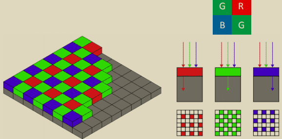

ccd常用线性扫描仪

#### CMOS sensor

每个像素的光电池由三层组成，它们传输不同范围的波长。由此产生的电子和“孔”在三个势阱中累积(每一层一个)。

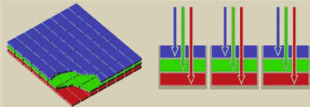

优点在于不会产生马赛克，缺点是由于需要在层次间传递光子，敏感度会有所下降

cmos常用于数码相机

### 使用图像处理器的仪器

**扫描仪**

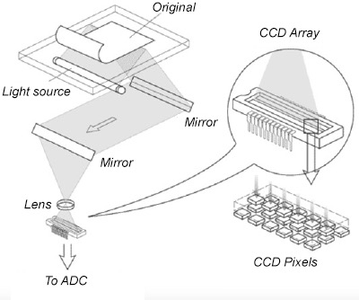

**数码相机：**

后扫描相机：

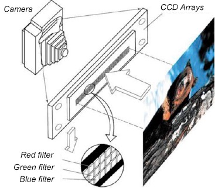

**三帧相机**

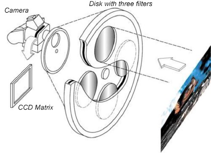

**使用单传感器的单帧相机**

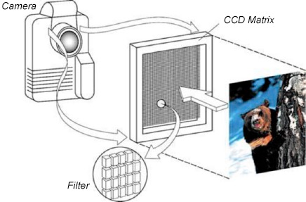

**三传感器单帧相机**

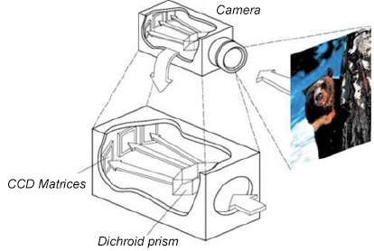

**超声波传感器**

**X光仪器**

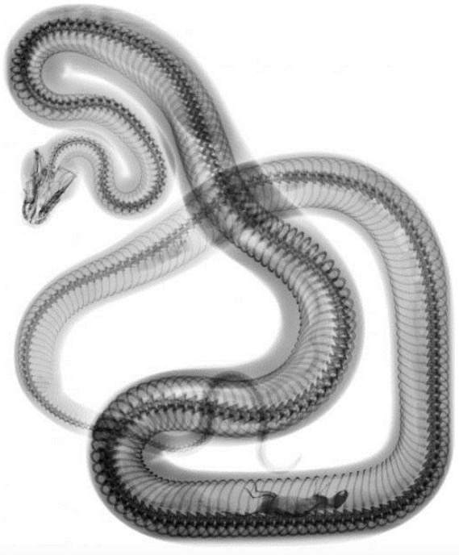

**tomography：X线断层摄影术**

核磁共振

CT

**地球遥感图像**

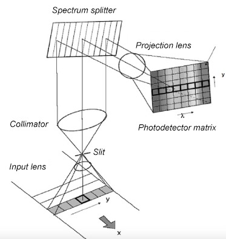

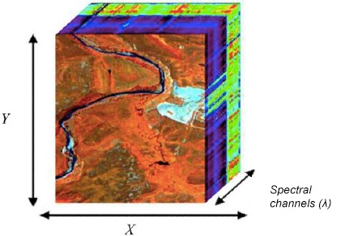

**雷达图像**

**相干编码成像**