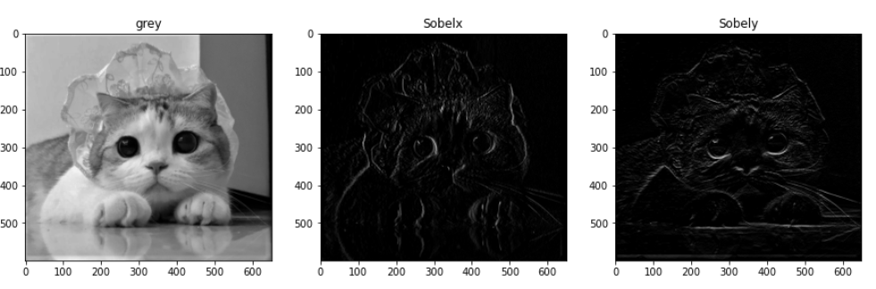
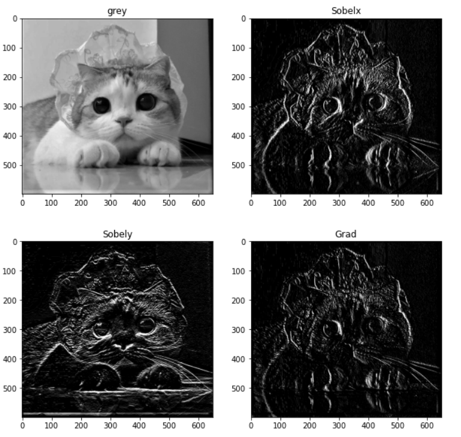
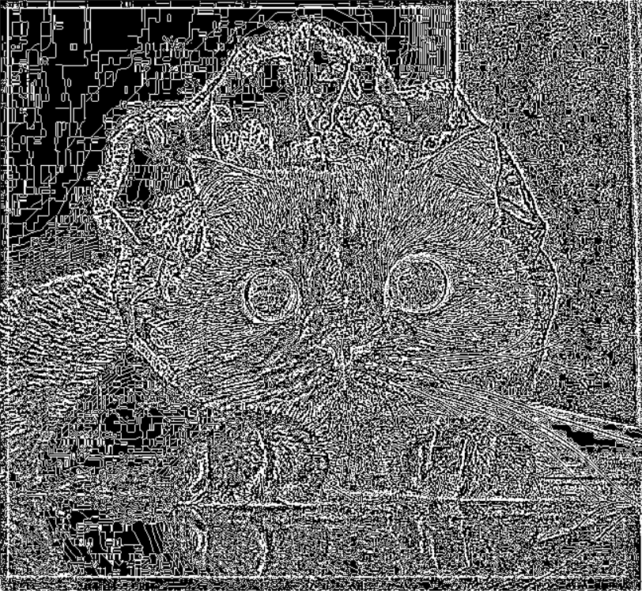
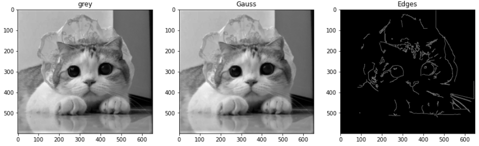
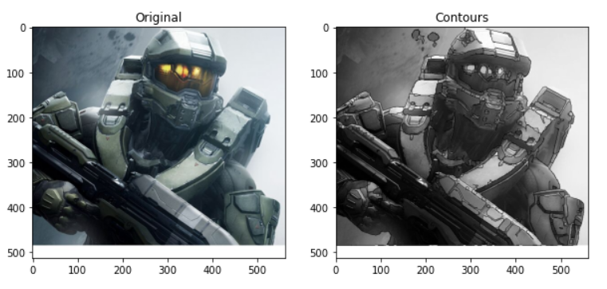
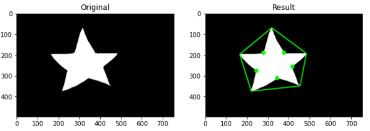

# 图像边缘

图像边缘并不是图像的外部轮廓，而是指满足条件得到的某一部分，通常用于图像修复，图像提取中。

### 图像梯度

##### 梯度

如果将图像看成二位离散函数，推行那个梯度就是二维离散函数的求导，例如函数G(x,y)在(x,y)的梯度入下所示:
$$
G(x,y) = dx(i,j)+dy(i,j) \\
dx(i,j) = Y(i+1,j) - I(i,j)\\
dy(i,j) = I(i,j+1) - I(i,j)
$$
其中I表示图像像素的值,例如RGB的值或者是灰度值:（i，j）表示像素的坐标。图像梯度可以使用中值差分的方式来实现。
$$
dx(i,j) = \frac{I(i+1,j)-I(i-1,j)}{2}\\
dy(i,j) = \frac{I(i,j+1)-I(i,j-1)}{2}
$$


##### Sobel与Scharr算子

Sobel算子可以在分别在x,y轴方向上计算求导,通过ksize设置卷积核的大小

当ksize=-1的时候,Sobel算子会使用卷积核为3*3的Scharr滤波器，从而变为Scharr算子，相对于Sobel算子效果更好，Scharr算子在x,y方向上的算子分别如下所示：
$$
K_{x} = \begin{bmatrix} -3 & 0 &3 \\ -10 & 0 & 10 \\ -3& 0 &3 \end{bmatrix} \\
K_{y} = \begin{bmatrix} -3 & -10 & -3 \\ 0 & 0 & 0 \\ 3& 10 & -3 \end{bmatrix} \\
$$


```python
dst = cv2.Sobel(src,ddepth,dx,dy,ksize = None)
```

- ddepth : 图像深度
- dx,dy : x与y轴方向上的导数
- ksize : 卷积核大小

一般来说dx,dy不会同时为1或者0，二十选择分为两步来求得x,y对应的导数

```python
#Scharr算子
Sobelx = cv.Sobel(grey,-1,1,0,ksize=3)
Sobely = cv.Sobel(grey,-1,0,1,ksize=3)

plt.figure(figsize = (15,15))
plt.subplot(131);plt.imshow(grey,cmap='gray');plt.title('grey')
plt.subplot(132);plt.imshow(Sobelx,cmap='gray');plt.title('Sobelx')
plt.subplot(133);plt.imshow(Sobely,cmap='gray');plt.title('Sobely')
```




获得x,y方向上的梯度之后,可以使用图像差取绝对值来获得具有高水平梯度和地垂直梯度的图像区域

```python
#Scharr算子
Sobelx = cv.Sobel(grey,-1,1,0,ksize=-1)
Sobely = cv.Sobel(grey,-1,0,1,ksize=-1)
grad = cv.subtract(Sobelx,Sobely)
grad=cv.convertScaleAbs(grad)
```




##### Laplacian算子

Laplacian算子的卷积核如下：
$$
K_{Lap} = \begin{bmatrix} 0 & 1 & 0 \\ 1 & -4 & 1 \\ 0 & 1 &0 \end{bmatrix} \\
$$
可以看作是调用二阶的Sobel算子进行运算的

```python
dst = cv2.Laplacian(src,ddepth,ksize = None)
```

实例代码如下:

```python
# Laplacian算子
grad = cv.Laplacian(grey,cv.CV_64F)
```




### Canny边缘检测

使用Canny能够更加高效地检测出图像的边缘

##### Canny边缘检测原理

主要由4个步骤组成:**取出噪声，计算梯度的阈值和方向,非极大值的抑制,滞后阈值**


进行Canny检测的时候比较容易收到高斯噪声的影响，所以首先需要使用高斯模糊消除高斯噪音。

噪声去除之后,会调用Sobel算子计算水平方向和数值方向的一阶导数，然后我也不会了之后再学吧


非极大值抑制指的是在获得图像梯度的大小和梯度之后是需要对整张图片进行一个扫描,去掉一些非轮廓上的点。最后需要确定哪儿些轮廓才是真正的轮廓,为此需要设置两个阈值:maxVal,minVal

当图像边缘的灰度梯度高于maxVal时，视为真轮廓,当低于minVal时，就将对应的轮廓进行舍弃。


##### Canny函数

```python
dest = cv2.Canny(unage,threshold1,threshold2,apertureSize=None,L2gradient)
```

- threshold1 : 下阈值 , minVal
- threshold2 : 上阈值 , maxVal
- apertureSize : 控制图像梯度中使用的Sobel卷积核的大小，默认为3
- L2gradient: 选择梯度大小的方程,设置为Ture（其实就是选择L2范数），如果设置为False则设置为L1范数
- edges：经过Canny边缘检测后得到的轮廓


**范例代码**

```python
#Canny算子

#高斯模糊
gauss = cv.GaussianBlur(grey,(3,3),0)

#Canny边缘检测
edges = cv.Canny(gauss,50,150)
```




# 图像轮廓

轮廓和边缘的区别在于任务的目标不同 

边缘检测目标是检测出图像的明亮变化明显的边缘

轮廓检测则是找到轮廓构成的图像

### 轮廓寻找与绘制

**轮廓寻找**

寻找轮廓使用cv2.findContours函数

```python
contours,hierarchy = cv2.findContours(image,mode,method)
```

- image：原图像
- mode：寻找轮廓的模式
  - cv2.RETR_EXTERNAL：只检测外轮廓
  - cv2.RETR_LIST：检测的轮廓不建立等级关系
  - cv2.RETR_CCOMP：建立两个等级的轮廓，最外层与内层
  - cv2.RETR_TREE：建立一个等级数结构的轮廓
- contours：找到的轮廓，为列表的形式，列表中是一个个小的列表，每个小列表代表一个轮廓线
- hierarchy：轮廓之间的结构关系

**轮廓绘制**

```python
dst = cv2.drawContours(image,contours,contoursIdx,color,thickness = None,lineType = None)
```

- image：在哪儿张图片上绘制轮廓
- contours：需要绘制的轮廓，必须要以列表的形式传入，切列表中的元素也必须是列表
- contoursIdx：轮廓的索引，当设置为-1时，会绘制出所有传入的contours
- color：线条的颜色
- thickness：线条的宽度
- lineType：线条的类型
- dst：绘制后输出的图像


**代码**

```python
#将图像转换为灰度图
grey = cv.cvtColor(img,cv.COLOR_BGR2GRAY)
#高斯模糊
gauss = cv.GaussianBlur(grey,(3,3),0)
#Canny边缘检测
edges = cv.Canny(gauss,50,150)
#去噪处理
kernel = cv.getStructuringElement(cv.MORPH_RECT,(5,5))
closed = cv.morphologyEx(edges,cv.MORPH_CLOSE,kernel)
#寻找轮廓
contours,hierarchy = cv.findContours(closed,cv.RETR_TREE,cv.CHAIN_APPROX_SIMPLE)
#轮廓绘制
out = cv.drawContours(grey,contours,-1,(0,255,0),1)

plt.figure(figsize=(10,10))
plt.subplot(121);plt.imshow(img,cmap='gray');plt.title('Original')
plt.subplot(122);plt.imshow(out,cmap='gray');plt.title('Contours')
```



### 凸包

**寻找凸包**

建立凸包的函数为cv2.convexHull

```python
hull = cv2.convexHull(points)
```

- hull：得到的凸包的角点

**凸性检测**

有的时候我们只是像判断一下图像内的物体是否为凸性物体，直接使用cv2.isContourConvex进行检测

```python
result = cv2.isContourConvex(contour)
```

- result：返回一个布尔值，True表示为凸性轮廓


### 轮廓的框定

#### 外接轮廓

**1.轮廓矩形**

```python
x,t,w,h = cv2.boundingRect(array)
```

- array：输入的轮廓
- x,y,w,h：轮廓矩形返回的x,y,宽,高坐标


**2.最小外接圆**

```python
(x,y), radius = cv2.minEnclosingCircle(points)
```

- points：输入的轮廓
- (x,y)：返回的外接圆坐标
- radius：返回的外接圆半径


#### 图像拟合

**1.椭圆拟合**

```python
ellipse = cv2.fitEllipse(points)
```

- points：输入的轮廓
- ellipse：返回的拟合椭圆轮廓


**2.直线拟合**

```python
vx,vy,x,y = cv.fitLine(points,distType,param,reps,aeps)
```

- points：输入的轮廓
- distType：距离类型,常用的为cv2.DIST_L2,表示最小二乘法
- param：距离参数
- reps：拟合直线需要的径向精度，通常设置为0.01
- aeps：拟合直线需要的角度精度，通常设置为0.01
- vx,vy：计算拟合得到的直线斜率
- x,y ：返回的拟合直线上一点的x,y坐标


### 常用的轮廓处理函数

#### 找凸缺陷

基本原理就是在凸包的基础上寻找对一个的凸缺陷,使用函数cv2.convexityDefects

```python
defects = cv2.convexityDefects(contour,convexhull)
```

- contour：输入的轮廓
- convexhull：轮廓对应的凸包hull,可以通过cv2.convexHull函数得到
- defects：找到的凸缺陷，为一个列表，列表中每一行包含对应凸缺陷的起点和终点，以及最远点和最远点的近似距离

示例代码：

```python
img = cv.imread('star1.png')
x,y = img.shape[:2]
grey = cv.cvtColor(img,cv.COLOR_BGR2GRAY)

#二值化
ret,thresh = cv.threshold(grey,0,255,cv.THRESH_BINARY+cv.THRESH_OTSU)
#寻找轮廓
contours,hierarchy = cv.findContours(thresh,cv.RETR_EXTERNAL,cv.CHAIN_APPROX_SIMPLE)
cnt = contours[0]
#得到凸包角点
hull = cv.convexHull(cnt,returnPoints = False )
#绘制凸缺陷
defects = cv.convexityDefects(cnt,hull)
for i in range(defects.shape[0]):
    s,e,f,d = defects[i,0]
    start = tuple(cnt[s][0])
    end = tuple(cnt[e][0])
    far = tuple(cnt[f][0])
    cv.line(img,start,end,[0,255,0],4)
    cv.circle(img,far,10,[0,255,0],-1)
plt.figure(figsize=(10,10))
plt.subplot(121);plt.imshow(grey,cmap='gray');plt.title('Original')
plt.subplot(122);plt.imshow(img,cmap='gray');plt.title('Result')
```



#### 判断点与轮廓的位置关系

判断图像上某个点和选定轮廓的位置关系,需要借助最短距离来判断。如果在轮廓外，则最短距离为负数，在轮廓内部，则为正数。

```python
dist = cv2.pointPolygonTest(contour,pt,measureDist)
```

- contour：选定的轮廓
- pt：点，以元组的形式传入点的坐标
- measureDist：用来确定是否计算距离，如果设置为True就会点与轮廓之间的最短距离；如果设置为False，智慧判断点与轮廓之间的位置关系，返回值只有1、-1、0这3种

```python
img = cv.imread('star1.png')
x,y = img.shape[:2]
grey = cv.cvtColor(img,cv.COLOR_BGR2GRAY)

#二值化
ret,thresh = cv.threshold(grey,0,255,cv.THRESH_BINARY+cv.THRESH_OTSU)
#寻找轮廓
contours,hierarchy = cv.findContours(thresh,cv.RETR_EXTERNAL,cv.CHAIN_APPROX_SIMPLE)

#最短距离
distance1 = cv.pointPolygonTest(cnt,(0,0),True)
distance2 = cv.pointPolygonTest(cnt,(300,210),True)

#距离显示
print("点1在外部"if distance1 < 0 else "点1在内部" if distance > 0 else "点1在轮廓上"  )
print("点2在外部"if distance2 < 0 else "点2在内部" if distance2 > 0 else "点2在轮廓上"  )
```

结果：

```shell
点1在外部
点2在内部
```


#### 形状匹配

对于两个不同的轮廓，可以使用cv2.matchShapes函数来判断他们的相似度

```python
match = cv2.matchShapes(contour1,contour2,method,param)
```

- contour1：轮廓1
- contour2：轮廓2
- method：匹配的方法
  - CONTOURS_MATCH_I1
  - CONTOURS_MATCH_I2
  - CONTOURS_MATCH_I2
- param：默认为0
- match：得到的匹配度，得到的匹配度越小说明相似度越高

```python
img = cv.imread('star1.png')
x,y = img.shape[:2]
grey = cv.cvtColor(img,cv.COLOR_BGR2GRAY)

#二值化
ret,thresh = cv.threshold(grey,0,255,cv.THRESH_BINARY+cv.THRESH_OTSU)
#寻找轮廓
contours,hierarchy = cv.findContours(thresh,cv.RETR_EXTERNAL,cv.CHAIN_APPROX_SIMPLE)

#最短距离
distance1 = cv.pointPolygonTest(cnt,(0,0),True)
distance2 = cv.pointPolygonTest(cnt,(300,210),True)

#距离显示
print("点1在外部"if distance1 < 0 else "点1在内部" if distance > 0 else "点1在轮廓上"  )
print("点2在外部"if distance2 < 0 else "点2在内部" if distance2 > 0 else "点2在轮廓上"  )
```

