## Python.Opencv基操

### 0.导入依赖

```python
import matplotlib as plt
import cv2
import numpy as np
```

### 1.图片显示与读取
#### 图片显示

waitKey(int a) 代表打开凸显之后显示的时间 0的时候代表按下任何按钮

当时间到了之后会调用destoryAllWindows,关闭图像窗口

```python
#创建一个函数方便调用
def cv_show(name,img):
    #img = np.flip(img,2)   如果已经进行过一次翻转的话记得还要反转回来
    cv2.imshow(name,img)
    cv2.waitKey(0)
    cv2.destroyAllWindows()
```

#### 读取图片

cv2.imread(img) 这个函数会返回一个RGB信息的列表给img

```python
img = cv2.imread('cat01.jpg');
```

注意：如果想要直接获取灰度图片，直接在读取的时候在imread第二个参数加上一个0

```python
img = cv2.imread('cat01.jpg',0)
```

由于opencv读取函数的方式是BGR，所以如果需要使用matplotlib显示图像可以首先使用np.flip进行一次反转

```python
img = np.flip(img,2)
```


### 2.直方图的绘制

在图像处理上，直方图是图像信息统计的有力工具。其实也就是统计一幅图某个亮度像素数量。

#### 直方图概念

要理解直方图，绕不开“亮度”这个概念。人们把亮度分为0到255共256个数值，数值越大，代表的亮度越高。其中0代表纯黑色的最暗区域，255表示最亮的纯白色，而中间的数字就是不同亮度的灰色。人们还进一步把这些亮度分为了5个区域，分别是黑色，阴影，中间调，高光和白色。


#### calcHist()显示直方图函数

```python
void calcHist( image,channels,mask,histSize,histRange );
```

参数解释：

- **mage**输入图像，传入时应该用中括号[]括起来
- **channels**:传入图像的通道，如果是灰度图像，只有一个通道，值为0，如果是彩色图像（有3个通道），那么值为0,1,2,中选择一个，对应着BGR各个通道。这个值也得用[]传入。
- **mask**：掩膜图像。如果统计整幅图，那么为none。主要是如果要统计部分图的直方图，就得构造相应的炎掩膜来计算。(类似图层模板，如果需要统计部分图片的信息就需要用到这个)
- **histSize**：灰度级的个数，需要中括号，比如[256]
- **ranges**:像素值的范围，通常[0,256]，有的图像如果不是0-256，比如说你来回各种变换导致像素值负值、很大，则需要调整后才可以。

#### 显示RGB图像的直方图

首先需要将获得的图像数据分割为BGR三通道的列表

```python
I_BAR = cv2.split(img)
```

然后一个通道绘制出一个直方图

```python
#基本参数
histSize = 256
histRange = (0,256)

bHist = cv2.calcHist(I_BAR,[0],None,[histSize],histRange)
gHist = cv2.calcHist(I_BAR,[1],None,[histSize],histRange)
rHist = cv2.calcHist(I_BAR,[2],None,[histSize],histRange)
```

使用plt.plot()就可以直接进行显示了

```python
plt.subplot(221),plt.imshow(img,'gray')
plt.subplot(222),plt.plot(bHist)
plt.subplot(223),plt.plot(gHist)
plt.subplot(224),plt.plot(rHist)
```

得到结果：

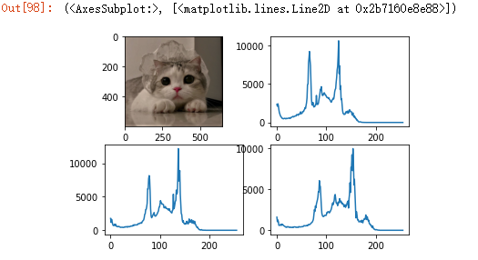


#### 3.直方图均衡化

直方图均衡化（histogram equalization）最简单的方法就是进行算数运算。旨在使得图像整体效果均匀，黑与白之间的各个像素级之间的点更均匀一点。 

##### 使用内置函数

直方图均衡化只要包括三个步骤：

1. 统计直方图中每个灰度级出现的次数；
2. 计算累计归一化直方图；
3. 重新计算像素点的像素值；


opencv提供了一个专用的函数cv2.equalizaHist()

这里直接使用一个灰度图片做演示

```python
img1 = cv2.imread('puff.png',0)
res = cv2.equalizeHist(img1)

Hist1 = cv2.calcHist(img1,[0],None,[histSize],histRange)
Hist2 = cv2.calcHist(res,[0],None,[histSize],histRange)

plt.subplot(221),plt.imshow(img,'gray')
plt.subplot(222),plt.imshow(res,'gray')
plt.subplot(223),plt.plot(Hist1)
plt.subplot(224),plt.plot(Hist2)
```

显示结果：

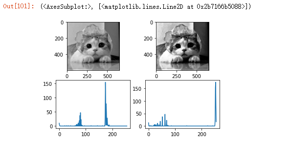

 ##### 算术运算

直方图的左边代表亮度为0，所以为了提升暗处的亮度，可以将直方图整体向右移动，比如我们可以直接让每一个像素点的亮度都加上某个一样的数字
$$
I_{new}(i,j) = I(i,j) + 50
$$
代码：

```python
img2 = img + 50
showHist(img2)
showSumHist(img2)
```

结果：

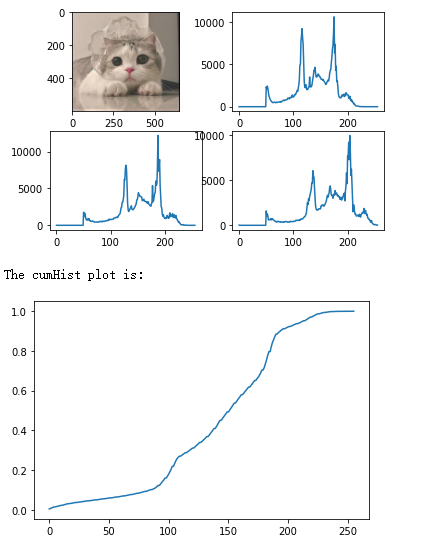

可以发现 所有的图像都整体向右边移动了


##### 动态范围拓展

**动态范围**：某一物理量最大值与最小值的比率，通常以对数表示，单位为dB。对于真实场景，它指场景中最明亮处与最黑暗处的亮度之比。

如果像素集中在某一个狭小的区域的话，为了提高暗部的亮度展示更多的细节，就需要使用DRS方法，使用以下的公式:
$$
I_{new} = (\frac{I-I_{min}}{I_{max}-I_{min}})^\alpha
$$


alpha的作用是与分布如何从直线变化有关。蓝色和读数代表阿尔法 <1，紫色和黑色代表阿尔法> 1

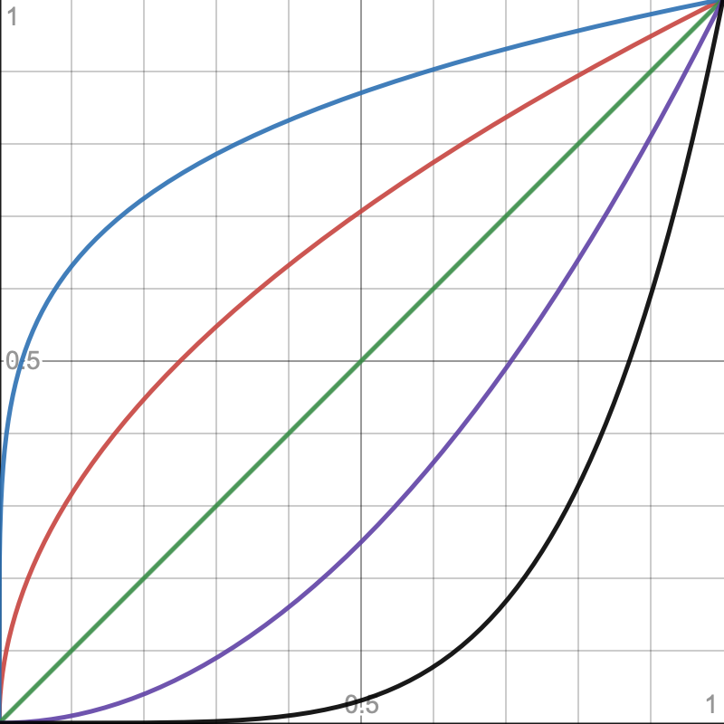

实际上就是使得数据能够归一化 从而显示更多的细节
代码：

```python
alpha = 0.5
#这里需要将原来图片数据类型int8变换为float
#因为这里的计算会用到浮点数
img3 = np.zeros(img.shape,dtype = np.float32)

for k in range(img.shape[2]):
    Imin = img[:,:,k].min()
    Imax = img[:,:,k].max()
    img3[:,:,k] = np.clip((((img[:,:,k] - Imin)/(Imax - Imin))**alpha),0,1)
showHist(img3)
showSumHist(img3)
```


结果：

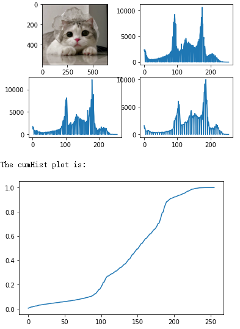

##### 统一转换

Uniform Transformation

使用以下公式:
$$
I{new} = (I_{new}-I_{min})*P(I)+I_{min}
$$

$$
P(I):= \sum_{m=0}^{i}Hist(m)
$$

这个地方我们知识将红色通道进行了转换 所以颜色看起来红红的

代码：

```python
hist = cv2.calcHist([img],[0],None,[256],[0,256])
cum_hist = np.cumsum(hist) / img.shape[0] / img.shape[1]

img4 = np.zeros(img.shape,dtype = np.uint8)

for k in range(img.shape[2]):
    Imin = img[:,:,k].min()
    Imax = img[:,:,k].max()
    img4[:,:,k] = np.clip( (Imax-Imin)*cum_hist[img[:,:,k]] + Imin  ,0,255)
showHist(img4)
showSumHist(img4)
```

结果：

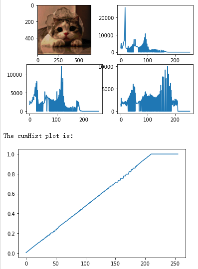

##### 指数转换
Exponential Transformation
$$
I_{new}=I_{min}-\frac{1}{\alpha}*ln(1-P(I))
$$
这里的alpha代表 constant characterizes transformation slope

代码：

```python
hist = cv2.calcHist([img],[0],None,[256],[0,256])
cum_hist = np.cumsum(hist) / img.shape[0] / img.shape[1]
alfa = 0.1
img5 = np.zeros(img.shape,dtype = np.uint8)

for k in range(img.shape[2]):
    Imin = img[:,:,k].min()
    Imax = img[:,:,k].max()
    img5[:,:,k] =  Imin - 1 / alfa * np.log(1 + 1e-3 - cum_hist[img[:,:,k]])
showHist(img5)
showSumHist(img5)
```

结果：

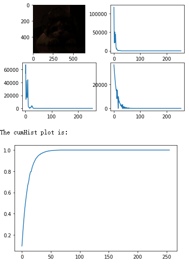

##### Rayleigh Transformation

$$
I_{new} = I_{min} + (2\alpha ^2ln(\frac{1}{1-P(I)}))^\frac{1}{2}
$$

代码：

```python
hist = cv2.calcHist([img],[0],None,[256],[0,256])
cum_hist = np.cumsum(hist) / img.shape[0] / img.shape[1]
alfa = 0.5
img6 = np.zeros(img.shape,dtype = np.uint8)

for k in range(img.shape[2]):
    Imin = img[:,:,k].min()
    Imax = img[:,:,k].max()
    img6[:,:,k] = Imin + (2 * alfa ** 2 *np.log(1 / 1 - cum_hist[img[:,:,k]]))**0.5
  
img6 = (255 * img5).clip(0, 255).astype(np.uint8)
showHist(img6)
showSumHist(img5)
```

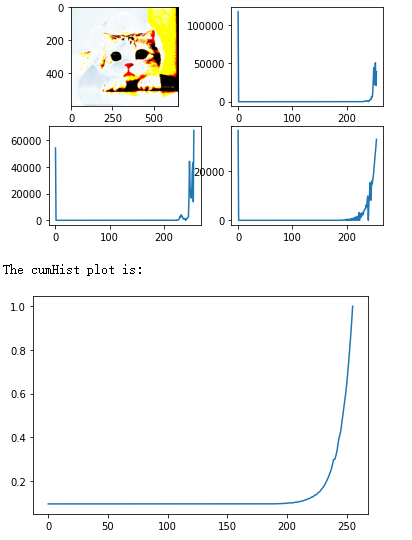

##### Transformation of 2/3-degree

$$
I_{new}=P(I)^\frac{2}{3}
$$

代码：

```
img7 = np.zeros(img.shape,dtype = np.float32)

for k in range(img.shape[2]):
    img7[:,:,k] = cum_hist[img[:,:,k]] ** (2/3)

img7 = (255 * img7).clip(0, 255).astype(np.uint8)
showHist(img7)
showSumHist(img7)
```

结果：

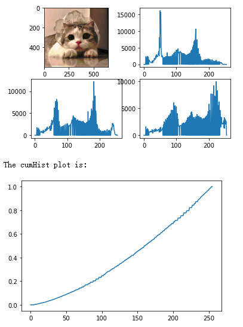

##### Hyperbolic Transformation

$$
I_{new} = \alpha^P(I)
$$

所考虑的直方图变换方法可用于消除某些类型的失真。 此外，这些方法可以在本地用于滑动窗口。 它允许增加个别区域的细节。

代码：

```python
alfa = 0.04
img8 = np.zeros(img.shape,dtype = np.float32)

for k in range(img.shape[2]):
    img8[:,:,k] = alfa ** cum_hist[img[:,:,k]]

img8 = (255 * img8).clip(0, 255).astype(np.uint8)
showHist(img8)
showSumHist(img8)
```

结果：

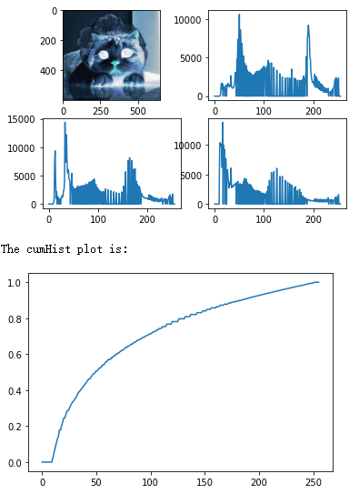

##### Clahe函数

使用opencv内置函数createCLAHE() 设置细节ClipLimit(4)

```python
clahe = cv2.createCLAHE()
clahe.setClipLimit(4)
res = clahe.apply(img1)

histSize1 = 256
histRange1 = (0,256)

Hist1 = cv2.calcHist(img1,[0],None,[histSize1],histRange1)
Hist2 = cv2.calcHist(res,[0],None,[histSize1],histRange1)

plt.subplot(221),plt.imshow(img1,'gray')
plt.subplot(222),plt.imshow(res,'gray')
plt.subplot(223),plt.plot(Hist1)
plt.subplot(224),plt.plot(Hist2)
plt.show()

showSumHist(res)
showSumHist(img1)
```

结果:

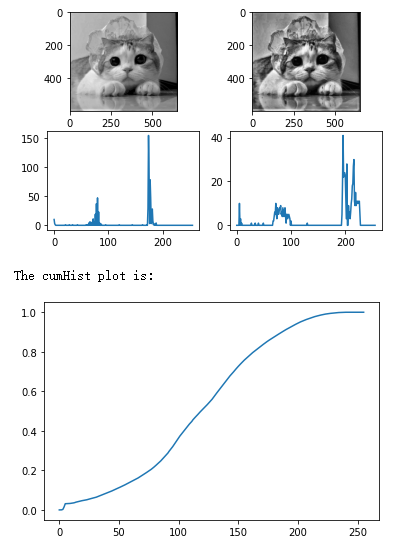


### 3.图像轮廓的检测

轮廓是一系列相连的点组成的曲线，代表了物体的基本外形，相对于边缘，轮廓是连续的，边缘并不全部连续。

一般地，获取图像轮廓要经过下面几个步骤：

- 读取图片。

- 将彩色图像转换成灰度图像。

- 将灰度图像转换成二值图形并查找其二值图像边缘即可（如canny边缘检测）。

- 显示轮廓边缘。


这里使用一个实例 使用定义好的函数

代码：

```python
#读取图像并且获取边缘信息
I = cv2.imread ( 'BarCode.png' , cv2.IMREAD_GRAYSCALE )
profile = I[ round ( I . shape [0] / 2) ,:]

#将边缘信息绘制到一个图片中
#获得一个大小合适的纯白色图像
profile_img = np.full((256,I.shape[1],3),255,dtype = np.uint8)   
DrawGraph(profile_img,profile,(0,0,0),profile.max())

plt.subplot(211),plt.imshow(I,'gray')
plt.subplot(212),plt.imshow(profile_img,'gray')
plt.show()
```

结果：

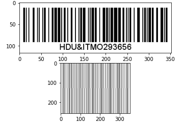

### 4.图像的投影

目的就是将图像的x轴和y轴上有的东西按照出现的频率投影出来 这样可以方便识别哪儿个位置出现了东西

公式也非常简单:
$$
ProjX(y) = \sum_{y=0}^{dim Y-1}I(x,y)
$$

$$
ProjY(x) = \sum_{x=0}^{dim X-1}I(x,y)
$$

$$
ProjE(t)=\sum_{xe_{x}+ye_{y}=t}I(x,y)
$$


举例:

代码：

```python
img2 = cv2.imread('name.png',cv2.IMREAD_COLOR)

if img2.ndim == 2:
    Proj_x = np.sum(img2,1) / 255
    Proj_y = np.sum(img2,1) / 255
else:
    proj_x = np.sum(img2,(0,2)) / 255 / img.shape[2]
    proj_y = np.sum(img2,(1,2)) / 255 / img.shape[2]

proj_x_img = np.full((256,img2.shape[1],3),255,dtype = np.uint8)
proj_y_img = np.full((256,img2.shape[0],3),255,dtype = np.uint8)

DrawGraph(proj_x_img,proj_x,(0,0,0),proj_x.max())
DrawGraph(proj_y_img,proj_y,(0,0,0),proj_y.max())

#翻转y轴投影的坐标轴 并且
proj_y_img = cv2.transpose(proj_y_img)
#这个是用来镜像翻转的 但是我好像用不到
#proj_y_img = cv2.flip(proj_y_img,1)

plt.figure(figsize=(20,10)) 
plt.subplot(221),plt.imshow(img2,'gray',aspect='auto')
plt.subplot(222),plt.imshow(proj_y_img,'gray')
plt.subplot(223),plt.imshow(proj_x_img,'gray')
plt.show()
```

显示结果：

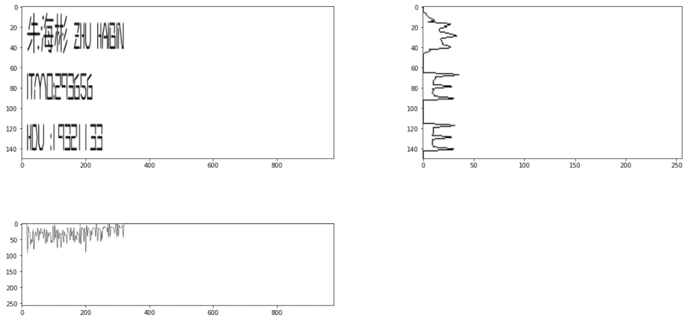


##  常用函数

1.显示图像

RGB：

```python
def cv_show(name,img):
    img = np.flip(img,2)
    cv2.imshow(name,img)
    cv2.waitKey(0)
    cv2.destroyAllWindows()
```

Gray

```python
def cv_show_gray(name,img):
    cv2.imshow(name,img)
    cv2.waitKey(0)
    cv2.destroyAllWindows()
```

2.展示累加直方图函数

```python
def showSumHist(img):
    print('The cumHist plot is:')
    hist = cv2.calcHist([img],[0],None,[256],[0,256])
    cum_hist = np.cumsum(hist) / img.shape[0] / img.shape[1]
    plt.plot(cum_hist)
    plt.show()
```

3.展示RGB图像的直方图函数

```python
def showHist(img):
    histSize = 256
    histRange = (0,256)
    I_BAR = cv2.split(img)
    bHist = cv2.calcHist(I_BAR,[2],None,[histSize],histRange)
    gHist = cv2.calcHist(I_BAR,[1],None,[histSize],histRange)
    rHist = cv2.calcHist(I_BAR,[0],None,[histSize],histRange)
    plt.subplot(221),plt.imshow(img,'gray')
    plt.subplot(222),plt.plot(bHist)
    plt.subplot(223),plt.plot(gHist)
    plt.subplot(224),plt.plot(rHist)
    plt.show()
```

4.直接在opencv显示的图像上画图

```python
# Draw a plot in a given image drawing context
# @param[in, out] image image drawing context
# @param[in] data_array data to draw
# @param[in] color color to use when drawing
# @param[in] max_val scale factor for the histogram values (default is 1)
def DrawGraph(image, data_array, color, max_val = 1.0):
  image_w = image.shape[1];
  image_h = image.shape[0];
  data_size = data_array.shape[0];

  step = image_w / data_size;

  for i in range(1, data_size):
    cv2.line(image, 
            (round(step * (i - 1)), image_h - int(image_h * data_array[i - 1] / max_val)),
            (round(step * i),       image_h - int(image_h * data_array[i] / max_val)),
            color, thickness = 1)

# Draw a histogram in a given image drawing context
# @param[in, out] image image drawing context
# @param[in] data_array data to draw
# @param[in] color color to use when drawing
# @param[in] max_val scale factor for the histogram values (default is 1)
def DrawHist(image, data_array, color, max_val = 1.0):
  image_w = image.shape[1];
  image_h = image.shape[0];
  data_size = data_array.shape[0];

  step = image_w / data_size;

  for i in range(1, data_size):
    cv2.rectangle(image, 
                 (round(step * (i - 1)), image_h - int(image_h * data_array[i - 1] / max_val)),
                 (round(step * i),       image_h),
                 color, thickness = -1)

```

5.展示lut处理之后的图像

```python
#展示图片函数
def show_lut(name,lut,img):
    img_lut = cv2.LUT(img,lut)
    cv_show('Image after the LUT',img_lut)
    hist = cv2.calcHist([img_lut],[0],None,[256],[0,256])
    cum_hist = np.cumsum(hist) / img.shape[0] / img.shape[1]
    hist_img = np.full((256,512,3),255,dtype = np.int8)
    DrawHist(hist_img,hist,(127,127,127),hist.max())
    DrawGraph(hist_img,cum_hist,(0,0,0),1)
    cv_show(name,hist_img)
```

6.展示ProFile

```python
def showProfile(img):
    if(img.ndim == 2):
        #灰度图像只有两个维度
        profile = img[ round ( img.shape[0] / 2) ,:]
    else:
        profile = img[ round ( img.shape[0] / 2) ,:,:]
    
    #创建一个纯白色图像
    profile_img = np.full((256,I.shape[1],3),255,dtype = np.uint8)
    
    if img.ndim == 2:
        DrawGraph(profile_img,profile,(0,0,0),profile.max())
    else:
        DrawGraph(profile_img,profile[:,0],(255,0,0),profile.max())
        DrawGraph(profile_img,profile[:,1],(0,255,0),profile.max())
        DrawGraph(profile_img,profile[:,1],(0,0,255),profile.max())
    plt.subplot(121),plt.imshow(img,'gray')
    plt.subplot(122),plt.imshow(profile_img,'gray')
    plt.show()
```

