# 推荐系统Baseline

[Toc]

## 问题

序列推荐问题中使用$$u,v$$分别用于标记用户与商品，使用$$ S_{u} $$用于表示用户集合$$u$$的单调顺序交换序列
$$
u = {u_{1},u_{2},...,u_{n}}\\
v = {v_{1},v_{2},...,v_{n}}\\
S_{u} = {v_{1}^{u},v_{2}^{u},...,v_{t}^{u},...,v_{n_{{u}}}^{u}}
$$
其中：$$v_{t}^{u}$$为用户u在时间t和商品交互的信息（说白了就是某个用户在t时间点上选择了哪儿个物品u），$$ n_{u}$$为用户u的交互序列长度

我们希望通过先前的交互经历序列$$S_{u}$$，预测用户u在时间$$n_{u} + 1$$时间段与商品v的交互概率

$$
p(v_{n_{u}+1}^{u} = v|S_{u})
$$
过去使用self-attention进行预测有两个很大的缺点，是使用序列是单向并且预测权重时使用的数据也是递增的，直接忽略了一大部分被预测单位之后的序列，但是事实上这一部分序列也可以作为表征用户的行为（上下文的理解）。

**@TODO**

- [x] 为什么$$S_{u}$$集合中的v下标会从时间变成用户交互序列的长度（还是说交互长度使用单位时间来表示的 搞不明白 不过问题不大）

- [x] Bert4Rec和Bert的区别是啥 我感觉就是套了个壳，好像一点变化都没有（也就多了个随机屏蔽）

  


## Bert4Rec

Bert是一个在NLP领域理解上下文的方法，Bert4Rec采用类似方法建立双向的self-attention模型来达打成当前序列与隐藏序列同时理解的方法。由于在双向运行的模型中常规的顺序预测不太直观，这里他们使用了完形填空的方法代替顺序预测（也就是随机屏蔽，然后通过上下文预测被屏幕物品的id，这样能够避免信息泄露保证泛化能力）结构图如下：

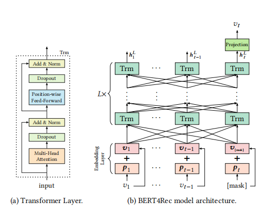

- 双向进行
- 随机屏蔽
- 多个Transformer的堆叠


### Transformer

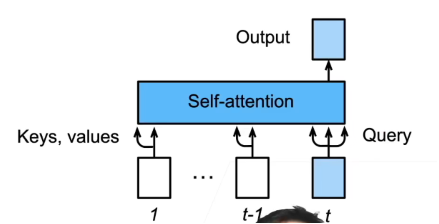

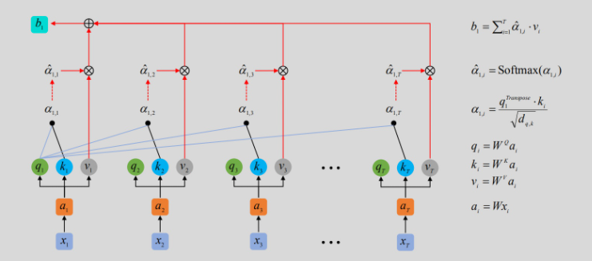

预测第t+1个输出的时候，编码器输入前t个预测值，其中t-1个作为key和value，第t个作为query输入进行预测

注意这里的$$W_{Q},W_{k},W_{V} $$ 这三个矩阵都是经过模型训练后学习到的参数,$$a_{t}$$是经过embedding层将现实中离散的物品进行连续处理的一个结果（类似于one-hot编码的一种处理，他可以很方便地进行降维与可视化）


### 代码运行

**代码文件树**

```bash
└─BERT4Rec-master
    ├─.idea
    │  └─inspectionProfiles
    ├─bert_train
    ├─CKPT_DIR
    │  └─ml-1mdefault
    ├─data
    └─__pycache__
```

运行代码分为两部分 首先需要生成带屏蔽的数据集，然后再基于此进行模型的训练

**生成带屏蔽地训练集**

```bash
python -u gen_data_fin.py \
    --dataset_name=${dataset_name} \
    --max_seq_length=${max_seq_length} \
    --max_predictions_per_seq=${max_predictions_per_seq} \
    --mask_prob=${mask_prob} \
    --dupe_factor=${dupe_factor} \
    --masked_lm_prob=${masked_lm_prob} \
    --prop_sliding_window=${prop_sliding_window} \
    --signature=${signature} \
    --pool_size=${pool_size} \
```

**训练模型**

```bash
CUDA_VISIBLE_DEVICES=0 python -u run.py \
    --train_input_file=./data/${dataset_name}${signature}.train.tfrecord \
    --test_input_file=./data/${dataset_name}${signature}.test.tfrecord \
    --vocab_filename=./data/${dataset_name}${signature}.vocab \
    --user_history_filename=./data/${dataset_name}${signature}.his \
    --checkpointDir=${CKPT_DIR}/${dataset_name} \
    --signature=${signature}-${dim} \
    --do_train=True \
    --do_eval=True \
    --bert_config_file=./bert_train/bert_config_${dataset_name}_${dim}.json \
    --batch_size=${batch_size} \
    --max_seq_length=${max_seq_length} \
    --max_predictions_per_seq=${max_predictions_per_seq} \
    --num_train_steps=${num_train_steps} \
    --num_warmup_steps=100 \
    --learning_rate=1e-4
```

直接用pycharm运行run.py好像也可以，问题不大


**参数调节**

打开bert_train文件夹中的json文件，比如这里打开 bert_config_ml-1m_64.json 这个文件

需要调节以下参数

```json
{
  "attention_probs_dropout_prob": 0.2,
  "hidden_act": "gelu",
  "hidden_dropout_prob": 0.2,
  "hidden_size": 64,
  "initializer_range": 0.02,
  "intermediate_size": 256,
  "max_position_embeddings": 200,
  "num_attention_heads": 2,
  "num_hidden_layers": 2,
  "type_vocab_size": 2,
  "vocab_size": 3420
}
```


debug看看**gen_data_fin.py**这个文件

```python
tf.logging.set_verbosity(tf.logging.DEBUG)
```

作用是将tensorflow按照最低级的日志输出

设置基本的超参数

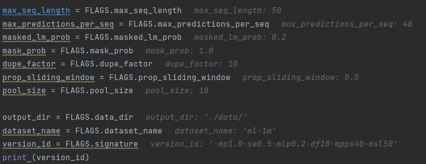

读取数据集并设置表头，此时的数据集还是三维的 包含训练集 验证集 测试集（也不过就是一个数字）

```python
dataset = data_partition(output_dir+dataset_name+'.txt')
[user_train, user_valid, user_test, usernum, itemnum] = dataset
```

查看数据集的基本情况

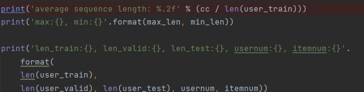

预处理之后有这样几个数据集：

user_train:用户点击的物品序列

user_train_data:在测试集上加了个item

user_test : 用户点击序列中商品的个数

user_valid：验证集中用户应该被推荐的物品

user_test_data：测试集用户点击的物品序列

user_test_data_output：用户点击序列的测试集


主要方法：

**gen_samples**：生成数据集，好多方法的套壳

**create_training_instances:**创建训练实例

- all_documents_raw：输入的数据集
- max_seq_length：想要使用的序列长度
- dupe_factor: 10，未知
- short_seq_prob：创建比最大长度短的序列的概率
- masked_lm_prob：屏蔽概率
- max_predictions_per_seq： 40，未知
- prop_sliding_window：未知
  - ​	**@TODO**好像和滑动窗口的长度有关，看的不是特别懂，设置随机长度的滑动窗口？
  - 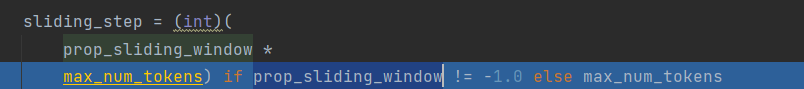
  - 好像是用固定步长从序列中选数据
- pool_size：池化核的大小 把多维数据进行降维
- force_last：Bool，是否使用上一次生成的实例数据

产生的all_documents中，每一个user点击的序列都以50为长度进行分组，不足50用0补足

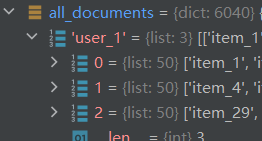

这里有个很奇怪的函数：apply_async

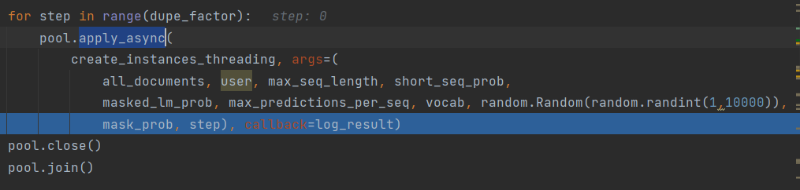

apply_async是异步非阻塞，指不用等待当前进程执行完毕，随时根据系统调度来进行进程切换

@TODO

- [x] 了解一下上面这一段代码的意思
- [ ] 好像涉及到了Python的多进程了 有点离谱了...


## SASRec

### 召回指标

使用的评价指标为：HR@10，NDCG@10

**命中率Hit Ratio(HR)**

在top-K推荐中，HR是一种常用的衡量召回率的指标，计算公式为：

$$
HR@K = \frac{NumberOfHits@K}{GT}
$$
分母是所有的测试集合，分子表示每个用户top-K列表中属于测试集合的个数的总和。

> 举个简单的例子，三个用户在测试集中的商品个数分别是10，12，8，模型得到的top-10推荐列表中，分别有6个，5个，4个在测试集中，那么此时HR的值是
> (6+5+4)/(10+12+8) = 0.5。

```python
def hit(gt_items, pred_items):
    count = 0
    for item in pred_items:
        if item in gt_items:
            count += 1
    return count
```


**Normalized Discounted Cummulative Gain(NDCG)**

推荐系统中**CG**表示将每个推荐结果相关性的分值累加后作为整个推荐列表的得分：

$$
CG_{k} = \sum_{i=1}^{k}rel_{i}
$$
其中，$$ rel_{i}$$表示未知i的推荐结果的相关性，k表示推荐列表的大小

CG没有考虑每个推荐结果处于不同位置对整个推荐结果的影响，例如，我们总是希望相关性大大的结果排在前面，相关性低的排在前面会影响用户体验。

**DCG**在CG的基础上引入了位置影响因素，计算公式如下：

$$
DCG_{k} = \sum_{i=1}^{k}\frac{2^{rel_{i}}-1}{log_{2}(i+1)}
$$
从上面的式子可以得出：1）推荐结果的相关性越大，DCG越大。2）相关性好的排在推荐列表前面的话，推荐效果越好，DCG越大。

DCG针对不同的推荐列表之间很难进行横向评估，而我们评估一个推荐系统不可能仅使用一个用户的推荐列表及相应结果进行评估，而是对整个测试集中的用户及其推荐列表结果进行评估。那么，不同用户的推荐列表的评估分数就需要进行归一化，也就是**NDCG**,公式为：

$$
NDCG@k=\frac{DCG_{u}@k }{IDCG_{u}} \\
NDCG@k=\frac{\sum _{u\in U}NDCG_{u}@k }{IDCG_{u}}
$$

### 主要思想

主要就是使用self-attention并用于序列推荐系统中去

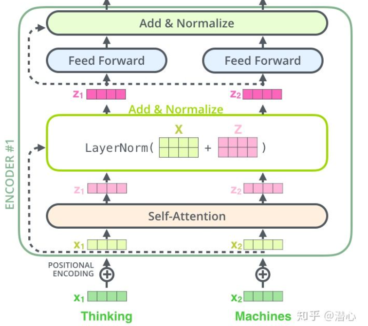

>  这里主要研究一下self-attention层，与Transformer的**「编码层」**大体上是一致的，是由**「多个（或单个）【自注意力机制+（残差连接、LayerNormalization、Dropout）+前馈网络】」** 组成。

**1.Self-Attention Block**

使用自注意力机制，定义如下：

$$
Attention(Q,K,V) = softmax(\frac{QK^{T}}{\sqrt{d}})V
$$
在本文中，对输入**E**通过**「线性投影」**转化为三个矩阵，并使用于上述注意力函数：

$$
S = SA(E) = Attention(EW^{Q},EW^{K},EW^{V})
$$
其中$$W^{Q},W^{K},W^{V}\in R^{d \times d}$$是线性投影矩阵，具体如下：

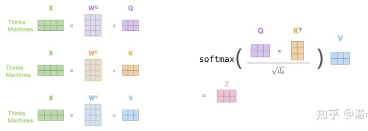

进行处理后使用前馈神经网络进行分类聚合，这里我们采用两层前馈神经网络


**2.Stacking Self-Attention Blocks**

这里与Transformer的思想类似，认为**「叠加多个自注意力机制层能够学习更复杂的特征转换」**。第$$b$$个自注意力block定义为：

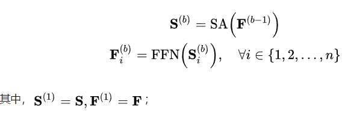

作者为了解决过拟合问题，在注意力机制层和前馈网络层假如残差连接，Layer Normalizaiton，Dropout来一直模型的过拟合，这一点其实类似于Transformer

$$
g(x) = x + Dropout(g(LayerNorm(x)))\\
其中：g(x)表示自注意力层与前馈神经网络
$$

### 讨论

文章通过设置4个研究问题来对实验进行讨论分析（这与NCF、ONCF的方式类似）：

- RQ1：SASRec的性能是否在实验中达到最优？
- RQ2：SASRec架构的各个成分对最终结果有什么影响？
- RQ3：SASRec模型的效率与可扩展性如何？
- RQ4：注意力权重能够学习到与位置或物品属性相关的有意义的模式吗?

