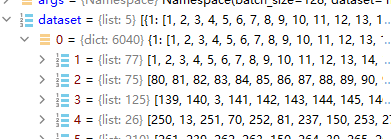

# Self-Attentive Sequential Recommendation

- [Wang-Cheng Kang](https://www.semanticscholar.org/author/Wang-Cheng-Kang/2741053), [Julian McAuley](https://www.semanticscholar.org/author/Julian-McAuley/35660011)
- Published 20 August 2018
- Computer Science
- 2018 IEEE International Conference on Data Mining (ICDM)

[Toc]

## 文章

**摘要**

Sequential dynamics are a key feature of many modern recommender systems, which seek to capture the 'context' of users' activities on the basis of actions they have performed recently. To capture such patterns, two approaches have proliferated: Markov Chains (MCs) and Recurrent Neural Networks (RNNs). Markov Chains assume that a user's next action can be predicted on the basis of just their last (or last few) actions, while RNNs in principle allow for longer-term semantics to be uncovered. Generally speaking, MC-based methods perform best in extremely sparse datasets, where model parsimony is critical, while RNNs perform better in denser datasets where higher model complexity is affordable. The goal of our work is to balance these two goals, by proposing a self-attention based sequential model (SASRec) that allows us to capture long-term semantics (like an RNN), but, using an attention mechanism, makes its predictions based on relatively few actions (like an MC). ==At each time step, SASRec seeks to identify which items are 'relevant' from a user's action history, and use them to predict the next item.== Extensive empirical studies show that our method outperforms various state-of-the-art sequential models (including MC/CNN/RNN-based approaches) on both sparse and dense datasets. Moreover, the model is an order of magnitude more efficient than comparable CNN/RNN-based models. Visualizations on attention weights also show how our model adaptively handles datasets with various density, and uncovers meaningful patterns in activity sequences.

文章出处：[1808.09781.pdf (arxiv.org)](https://arxiv.org/pdf/1808.09781.pdf)

代码：[kang205/SASRec: SASRec: Self-Attentive Sequential Recommendation (github.com)](https://github.com/kang205/SASRec)


实验环境(tf1.x)：

python >= 3.6

tensorflow >= 1.14.0

cuda >= 10.1

cudnn == 7.6.0

numpy == 1.16.0 


## 数据预处理

输入的数据格式是二元组和(userID,itemID)这样的格式输入的，经过处理之后能够变成序列模式：

```python
def data_partition(fname):
    usernum = 0
    itemnum = 0
    User = defaultdict(list)   # 最后输出的用户也是list类型的
    user_train = {}
    user_valid = {}
    user_test = {}
    # assume user/item index starting from 1
    f = open('data/%s.txt' % fname, 'r')
    for line in f:
        u, i = line.rstrip().split(' ')
        u = int(u)
        i = int(i)
        usernum = max(u, usernum)
        itemnum = max(i, itemnum)
        User[u].append(i)

    # 构建测试集，训练集以及验证集
    # 最后一个交互的物品作为测试集，倒数第二个交互的物品作为验证集，其他作为训练集
    for user in User:
        nfeedback = len(User[user])
        # 如果用户序列太短，则不考虑把这个用户作为测试集
        if nfeedback < 3:
            user_train[user] = User[user]
            user_valid[user] = []
            user_test[user] = []
        else:
            user_train[user] = User[user][:-2]
            user_valid[user] = []
            user_valid[user].append(User[user][-2])
            user_test[user] = []
            user_test[user].append(User[user][-1])
    return [user_train, user_valid, user_test, usernum, itemnum]
```

这里是处理之后的数据：




## 模型的实现

