# 基础文章研究

[Toc]

## KQV融合方式

**Non-invasive Self-attention for Side Information Fusion in Sequential Recommendation**

文章的意图主要在于考虑序列输入中的其他信息，因为Bert用于处理序列化信息时只能考虑一种tokens的输入，但是再推荐场景中还有很多例如duration，past_days这种周边信息应该也要进行一定的考量，作者将其称为Non-Invasive.

文章主要解决了信息过载的问题

#### Non-Invasive

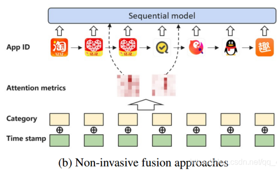

如上图所示，这里并没将这三种不同类型的信息进行直接fusion，而是通过修改Attention metrics的方法加入到了sequential model这种方法并没有硬性的修改appID的embedding表示。所以被称为Non-Invasive。

然后作者将信息进行了分类：

- Item-related
  - price,data of production, category, ...
- Behavior-related
  - type of action, time of execution, ...

这里用作输入的时候就需要进行一定的分类：

$$
S_{u} = [v_{u}^{(1)},v_{u}^{(2)},...,v_{u}^{(n)}]\\
v_{u}^{(j)} = (I^{k},b_{i,j}^{(1)},...,b_{u,j}^{(q)})\\
I^{k} = (ID^{k},f_{k}^{(1)},...,f_{k}^{(p)})
$$
其中，第一个式子表示输入的历史sequence，第二个式子表示Behaviour-related信息，第三个式子表示item-related信息

#### NOVA-Bert

这个模型是基于Bert4Rec并对输入的信息进行一定的处理，右边为处理后的NOVA-Bert4Rec模型

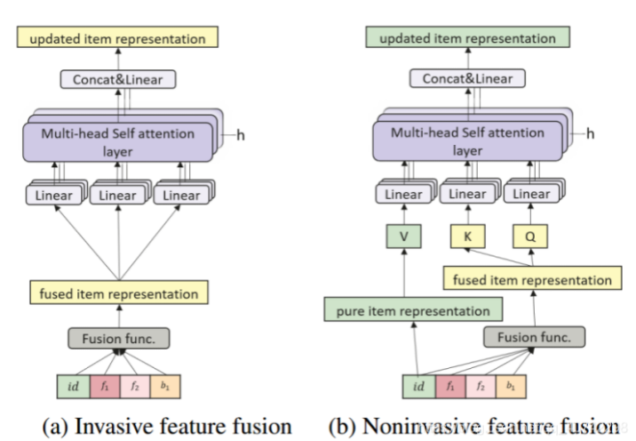

对于信息的融合方式，这里有做出了进一步的细分：

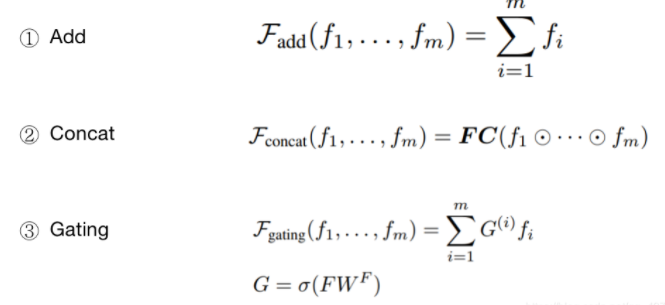

## 第三方信息

### 时间间隔 TiSAS4Rec

**Time Interval Aware Self-Attention for Sequential Recommendation**

**时间间隔感知的自注意力序列推荐**

原paper：https://dl.acm.org/doi/10.1145/3336191.3371786

源码解读：https://github.com/Guadzilla/Paper_notebook/tree/main/TiSASRec

对于实时推荐系统的建立具有很大意义

#### TiSAS4Rec

是SASRec工作的延续，在self-attention的基础上加了绝对位置信息和相对时间间隔信息（加在Q和K里）取得了更好的performamce。

其解决了如下问题：

- 结合了**绝对位置编码**和**相对时间间隔**编码的优点。
- 证明了使用相对时间间隔的有效性。

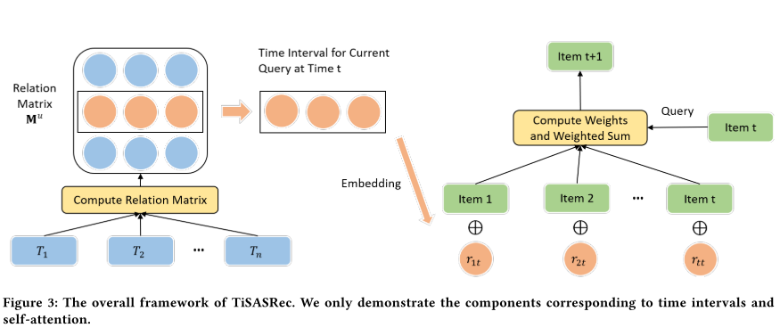

将所有的时间点计算一个相关性矩阵，然后找到需要推荐的时间点t，将矩阵中这一行的相关性数据取出并且计算出embedding值后与物品的embedding进行合并。

#### 个性化时间间隔

规定了序列S的maxlen(n)，长度小于n的序列用一个特殊标记的padding item来填充(padding)。时间序列T用第一个item的timestamps来填充(padding)

个性化时间间隔指的就是时间上的缩放操作，对于某个用户u来说，时间戳序列$$t = (t_{1},t_{2},...,t{n})$$,用任意两个物品的时间戳之差表示物品之间的时间间隔，作为仍以两个物品之间的关系$$r_{ij}$$,这样就能得到时间间隔的集合$$R^{u}$$。在此基础之上规定一个缩放系数$$r_{min}^{u} = min(R^{u})$$，即序列中最小时间间隔，再对素有时间间隔缩放$$r_{ij}^{u} = \lfloor \frac{|r_{i}-r_{j}|}{r_{j}^{u}} \rfloor$$得到最终的时间间隔矩阵$$M^{u} \in N^{n \times n}$$:

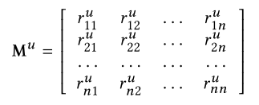

在个性化时间间隔实验的选取上，分别使用时间戳，没缩放的时间间隔以及个性化（根据每个用户最小时间间隔缩放后的时间间隔）进行对比，最后发现效果还是文章提出的个性化时间间隔效果最好

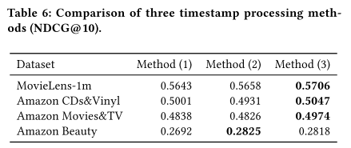

### 时间间隔 Meantime

**MEANTIME: Mixture of Attention Mechanisms with Multi-temporal Embeddings for Sequential Recommendation**

原文连接：[MEANTIME: Mixture of Attention Mechanisms with Multi-temporal Embeddings for Sequential Recommendation (acm.org)](https://dl.acm.org/doi/pdf/10.1145/3383313.3412216)

主要模型的框架如下：

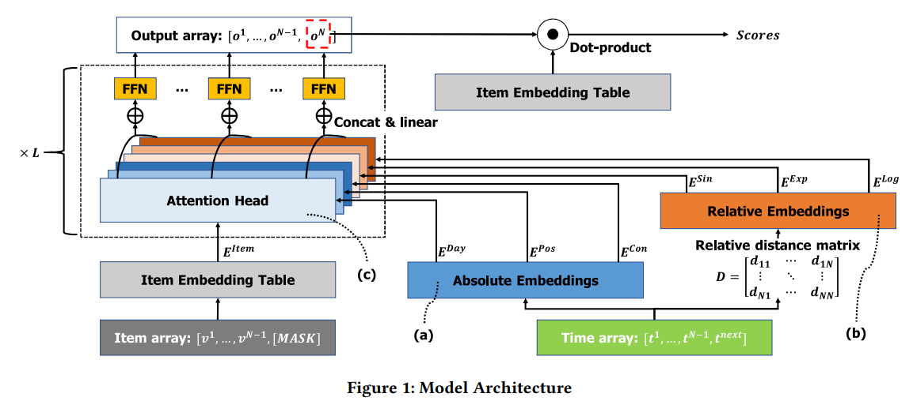

### 用户信息 SSE-PT

#### 正则化

正则化 (Regularization) 是机器学习中对原始损失函数引入额外信息，以便防止过拟合和提高模型泛化性能的一类方法的统称。

但是在这里，作者认为SASRec模型中有一个很大的问题是模型非个性化，为了提高模型的泛化能力作者引入自己提出了[**Stochastic Shared Embeddings**]正则化技术。

SSE-PT的结构示意图如下：

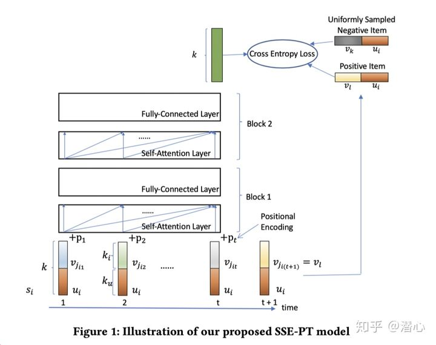

在进行embedding的时候，同时引入物品与用户

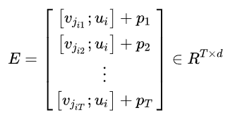

其中：$$[v_{it};u_{i}]$$表示t时刻的物品embedding与用户u的embedding的拼接,$$p_{T}$$为位置编码

>**正则化技术：**
>
>SSE的主要思想是在SGD中将Embedding内容以事先定义好的概率、$$p$$随机替换为另一个Embedding内容，从而使Embedding层具有正则化的效果。（或者说是增加一定的惩罚项，使得模型的泛化能力能够得到提升）

#### 长序列处理--SSE-PT++

SSE-PT的模型复杂度为$$O(T^{2}d + Td^{2})$$，当序列过于长且$$t > T$$的时候，就需要进行平均采样，以保证模型的可行性

这里提出一个超参数$$p_{s}$$

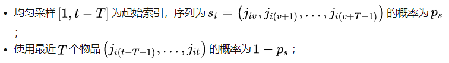

作者采取的策略也是本文的一个亮点，后面的结果也证明了这个观点，并不是采样概率为0的时候效果最好。 

### 用户信息 UPRec

**UPRec: User-Aware Pre-training for Recommender Systems [submitted to TKDE]**

原文地址：https://arxiv.org/pdf/2102.10989.pdf

先前的推荐系统里的预训练模型都只是专注于利用用户行为序列里面的通用序列模式，但是他们忽视了使用用户的信息来捕获个性化的兴趣。在这篇文章里作者提出一个用异构用户信息来增强预训练模型。UPRec利用用户属性和结构化的社交图来构建预训练阶段的自监督目标函数并提出两个用户感知的预训练任务。

这个模型也同样使用到了Bert对模型进行相应的训练，它为模型设立了三个主要的任务。

第一，为了能够捕获交互序列的内部结构特征，其仿照BERT的训练方式，让模型去预测被掩盖的物品 (**Mask Item Prediction**)；第二，通过将用户的历史交互序列输入给BERT，得到用户的表示向量，再通过这个表示向量去预测用户的属性特征 (**User Attribute Prediction**)，这个任务主要是希望模型能够从用户的属性特征中得到更多的监督信号，以提升序列化数据的表示能力；第三，考虑到用户的社交关系 (social relations) 也能在一定程度改善个性化推荐的效果，这篇论文还设计了社交关系预测 (**Social Relation Detection**) 的预训练任务，通过BERT学习到的用户表示去预测用户之间的社交关系，从而提升模型对用户交互序列的建模能力。下图便展示了模型结构以及模型与三个预训练任务之间的数据流。

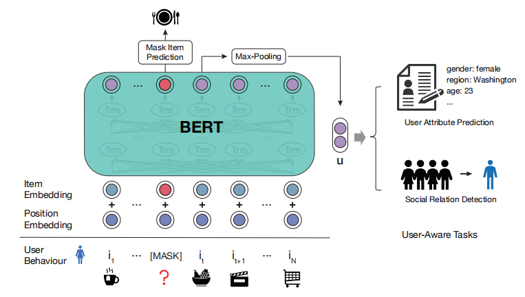

最后，这篇论文再通过“下一个物品推荐” (Next Item Prediction) 来微调前面预训练好的模型。实验结果表明了这种预训练方法能够提升模型的表现。

## 增强模型

### 全局数据增强 FISSA

**FISSA: Fusing Item Similarity Models with Self-Attention Networks for SequentialRecommendation**

FISSA：融合项目相似度模型和自注意网络的时序推荐

>  解决的**问题**：
>
> - 目前的模型都关注于短期的兴趣，而对于那些关注长期兴趣的方法都过于简单（作者称为全局，静态的偏好）
> - 现在的模型都认为自己能够完全掌握用户的偏好，但是事实上用户的兴趣取向是很难直接进行预测的。判断产品能否吸引用户的正确方式是考虑他如何能够引起用户不同部分的兴趣（短期与长期）

说白了就是文章想用一种方法同时关注短期与长期兴趣，将二者进行融合并关注模型的效果。

FISSA模型结构清晰，主要分为三个模块：

- 局部学习模块
- 全局表示模块
- 门控函数（文章的亮点，是一种类似于LSTM的函数）

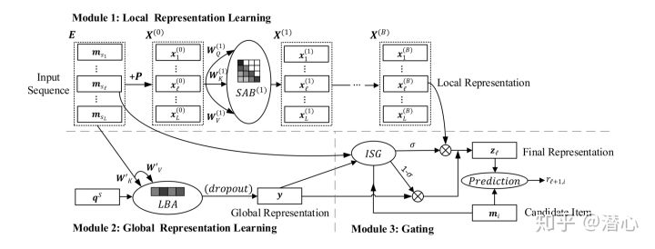

#### 全局表示学习

作者认为不同的历史物品有不同的权重，但是为了解决如何分配千种，这里它使用了attntion mechanism，但是其中的query是可学习的，通过query来实现对每个历史物品权重的分配（attention network）

$$
y = LBA(E) = softmax(q^{S}(EW_{K}^{'})^{T})EW_{V}^{'}
$$
其中$$E \in R^{L \times d}$$为初始输入矩阵，$$W^{'}_{K},W^{'}_{v} \in R^{d \times d}$$为学习矩阵

#### 融合方法---相似度门控

为了解决序列推荐中用户意图不确定性的问题，受**「神经注意物品相似度(NAIS)」** 的启发，作者提出一个`item similarity gating`模块，通过建模候选物品$$i$$和最近交互的物品$$s_{l}$$之间的物品相似度，以及候选物品![[公式]](https://www.zhihu.com/equation?tex=i)和历史行为物品的聚合之间的物品相似度来计算局部表示和全局表示的权重，如下所示：

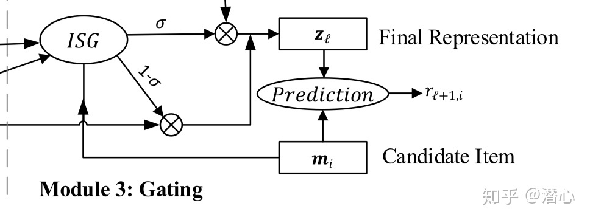

这个门控函数就是不知道是否可行，之后有兴趣再回来研读

### 局部数据增强 Locker（重要）

**Locker: Locally Constrained Self-Attentive Sequential Recommendation**

具有局部约束力序列推荐

全局注意力机制虽然可以较好的捕捉长期兴趣，但是对短期兴趣的捕捉能力不强，近期的一些方法发现适当的归纳局部和其他偏差可以提高自注意力的泛化能力。

