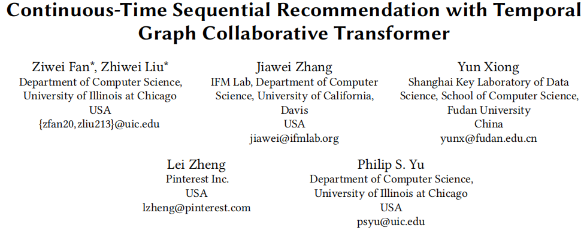
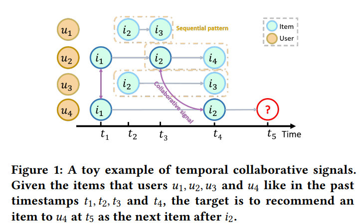
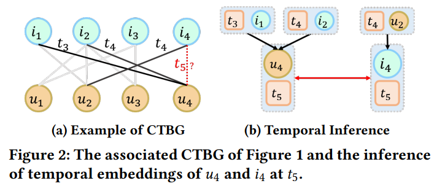
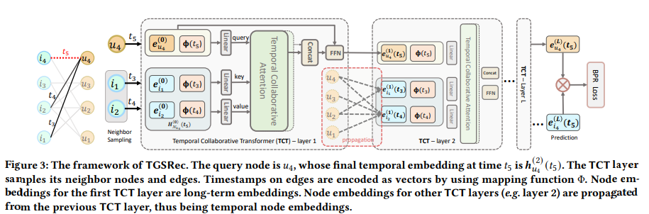
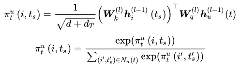
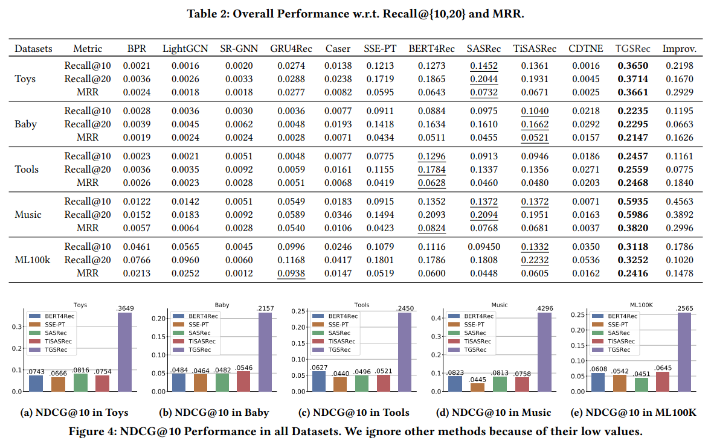

## [推荐系统阅读笔记]CIKM/21 Continuous-Time Sequential Recommendation with Temporal Graph Collaborative Transformer

> 翻译：通过二部图和注意力机制聚合序列信息和时间信息的推荐方法

[Toc]

> 原文连接：https://dl.acm.org/doi/pdf/10.1145/3459637.3482242
>
> 代码连接：[Continuous-Time Sequential Recommendation with Temporal Graph Collaborative Transformer | Papers With Code](https://paperswithcode.com/paper/continuous-time-sequential-recommendation)
>
> Github：[GitHub - DyGRec/TGSRec](https://github.com/DyGRec/TGSRec)

### 1.创新点与解决问题

传统的序列推荐系统模型中更多关注的是用户-商品这种顺序的模式，通过其位置的相互关系以及上下文的联系等进行推荐。作者认为这种模式忽略了时间因素是不妥的，而不同的时间点用户-物品的交互信息之间存在的协作关系也能够作为推荐物品的参考依据。

这里拿作者给的图举例时间协作因素的重要性：

使用黄色边框标记，分别代表用户$u_{1},u_{2},u_{3}$中物品点击的序列关系，紫色线代表时间写作关系。这里我们需要做的是为用户$u_{4}在t_{5}$时刻推荐物品$i_{x}$

如果我们只考虑序列模式的话，我们更可能会给用户$u_{4}$推荐物品$i_{3}$而不是$i_{4}$，因为$i_{3}$在$i_{2}$后面出现了两次，而$i_{4}$只出现了一次。但是如果我们考虑时间协作因素的话，我们可能会推荐$i_{4}$，因为用户$u_{2},u_{4}$都在$t_{1}$时刻选择了物品$i_{1}$，并且之后也都与$i_{2}$进行交互，这样他们之间的相似性就会更大。

以上分析得到了截然不同的结果，作者希望使用一种模型将序列信息与时间协作信息进行整合。

**存在的问题：**

主要在于如何在SR中整合时间协作信息

1. 如何同时为序列信息与时间协作信息进行同时编码
2. 如何正确表示时间协作信息的效应，如何度量他们相互造成影响的大小

### 2.模型结构

传统的Transformer模型只能表示物品与物品之间的序列关系，很难衡量时间造成的相关系数。

作者自己创造了一个叫**T**emporal **G**raph **S**equential **Rec**commender(**TGSRec**)的模型，主要有两种模块：

- 时间协作Transformer（TCT）
- 图形信息传播

TCT层主要用于捕获时间协作信息，其中query来自目标节点（用户或者是物品），而key与value来自与其连接的其他节点。第二个模块主要使用连续时间二部图（CTBG），目的是保持目标节点有序，在前一节点训练得到的参数能够传播给后一节点，从而保证时间协作信息与信息能够得到有效统一。Figure2是作者争对Figure1进行的举例：

如上CTBG为一个连续时间二部图，用于描述物品，用户，时间之间的交互关系。左右两个子图$U,I$分别代表用户与物品的子集，每一条边都是一个元组$e=(u,i,t),u\in U,i \in I$，$I_{u}(t)$表示时间戳t之前用户交互的物品集合，$I/I_{u}(t)$表示剩下的物品。

#### **模型的结构**

##### **1.Embedding Layer**

*1.1 Long-Term User/Item Embedding*

用户和物品的embedding值$e_{u},e_{i} \in R^{d}$，使用embedding table $E = [E_{U};E_{I}] \in R^{d \times |V|}$,$V = U \cup I$

*1.2 Continuous-Time Embedding*

作者定义了一个连续时间编码函数：$\Phi : T \mapsto R^{d_{T}}$,用于表示时间跨度在表达时序效应与揭示序列模式方面起到的重要作用。时间编码函数将时间戳嵌入到向量中，将时间跨度表示为相应编码时间嵌入的点积，由此我们将时间效应定义为连续时间空间中时间跨度的函数。

给定代表同一用户的元组$(u,i,t_{1}),(u,i,t_{2})$，时序效应定义为函数$\Psi(t_{1} - t_{2}) \mapsto R$,用于变送hi两个时间戳的相关性：

$$
\Psi(t_{1} - t_{2}) = K(t_{1} - t_{2}) = \Phi(t_{1}) \cdot \Phi(t_{2})\\
$$
Where: $K$ denote the temporal kernel.

上面的公式实现起来略微复杂。为了拓展到数据集中没有标注出来的时间戳，将编码器进行一定的拓展，使其能够表示任意时间跨度的编码。通过对时间特征的显式表示，实现了时间嵌入：

$$
\Phi(t) = \sqrt{\frac{1}{d_{T}}}[cos(\omega_{1}t),sin(\omega_{2}t),...,cos(\omega_{d_{T}}t),sin(\omega_{d_{T}}t)]^{T}
$$
其中$\omega  = [\omega_{1},...,\omega_{d_{T}}]^{T}$是可学习的参数,$d^{T}$代表维度

##### **2.Temporal Collaborative Transformer**（TCT）

作者进行改进后的TCT层有以下两点优势：

1. 从用户/物品嵌入和时间嵌入两方面构建信息，明确表征相关的时间效应;
2. 使用协同注意模块，该模块通过对用户-物品交互的重要性进行建模，改进了现有的自注意机制，从而能够明确识别协同信号。

*2.1 Information Construction*

用户u在t时刻在l-th层的查询query表示如下，其中$e$表示时序嵌入,$\Phi$表示时间协作嵌入（见.2）：

$$
h_{u}^{l-1}(t) = e_{u}^{l-1}||\Phi(t)\\
h_{u}^{l-1}(t) \in R_{d+d_{T}}
$$
这里||表示连接操作，作者为了简单起见使用了连接，可以考虑采用其他的方式进行研究。以上的公式只研究了用户自身的因素，在考虑其他用户造成的影响，对于用户u交互过的item进行采样，得到S个样本,相当于这些样本都是用户u的邻居，现在计算他们对于u的时间协作影响

$$
h_{i}^{(l-1)}(t_{s}) = e_{i}^{(l-1)}(t_{s})||\Phi(t_{s})
$$
计算方式和上面的大差不差

*2.2 Information Propagation*

通过线性组合方式将之前得到的信息进行一定的整合:

$$
e_{N_{u}}^{(l)}(t) = \sum_{(i,{t_{s}})\in N_{u}(t)}\pi_{(t)}^{(u)}(u,t_{s})W_{U}^{(l)}h_{i}^{(l-1)}(t_{s})
$$
where:$N_{u}$ denote the information of sampled neighbours

顺便吐槽一下用什么符号不好偏偏用$\pi$

*2.3 Temporal Collaborative Attention*

这里讨论的是2.2中的$\pi$函数，也就是改进后attention机制：

使用点积改写，第一个式子能改写成如下如下：

$$
e_{u}^{l-1}(t) \cdot e_{i}^{l-1}(t_{s}) + \Phi(t) + \Phi(t_{s})
$$
其中，第一项表示用户-物品协作信号，第二项根据式(1)对时间效应进行建模。有了更多的堆叠层，协作信号和时间效应就纠缠在一起，紧密地联系在一起。

在忽略时间并且合并上面两个式子，我们会得到一个和transformer中attention机制很像的一个式子：

$$
e_{N_{u}} = V_{u} \cdot Softmax(\frac{K^{T}_{u}q_{u}}{\sqrt{d+d_{T}}})
$$
这个模型中的注意力不是自我注意力，而是时间协作注意力，它联合建模用户-道具交互和时间信息。（毕竟key和value都被魔改过了）

*2.4 Information Aggregation*

这一步的内容是将之前得到的两种信息进行融合，作者使用了前馈神经网络（FFN）聚合信息，FFN中有两层线性变换和ReLU激活函数，输出可以继续作为输入或者直接作为最后结果用于预测。

$$
e_{u}^{(l)}(t) = FFN(e_{N_{u}^{l}}(t) || h_{u}^{l-1}(t))
$$
*2.5 Generalization items*

作者的意思是上面的公式的query都能将用户换成物品作为输入，这样就能获得物品的embedding值

### 3.模型效果

#### 模型预测

TGSRec使用了$I$​个TCT层，得到物品与用户的embedding后预测分数公式如下，再进行排序得到推荐结果

$$
r(u,r,i) = e_{u}^{L}(t) \cdot e_{u}^{(L)}(t)
$$

#### 模型优化

这里作者使用了BPR作为损失函数（贝叶斯个性化排序），推导如下有空看看

[推荐系统中的BPR算法 - 知乎 (zhihu.com)](https://zhuanlan.zhihu.com/p/60704781)

同时也使用了BCE，两种方法进行比较实验

[CE Loss 与 BCE Loss 学习和应用 - 知乎 (zhihu.com)](https://zhuanlan.zhihu.com/p/421830591)

#### 模型结果

Static models: BPRMF,GNN-based model LightGCN

Temporal models: CTDNE,TiSASRec,JODIE

Transformer-based SR models: SASRec,BERT4REC,SSE-PT,TiSASRec

other SR model: FPMC,GRU4Rec,Caser, SR-GNN

### 4.写在最后

作者的模型效果是非常好的，也考虑到了不同用户之间在时间上的交互信息，TCT层能够编码序列模式和协作信号，并揭示时间效应，每一项评价指标和使用的训练集都大大优于经典模型。但是不太能确定模型是否具有泛化能力，论文中说在进行评价的时候为了加快速度只选取了1000个负样本进行评价，这样就导致经典模型的得分与SOTA上的得分差距较大。在设置时间协作embedding的时候作者根据用户的编号对相邻节点进行排序，但是这样没有考虑邻居对于目标用户的相似性，可能会有一点不太周到的地方吧。另外感觉时间嵌入的意义其实并没有位置嵌入更加重要，是否可以权衡一下哪儿一种更加重要。bert也只是使用了简单的位置嵌入就获得了比较不错的效果。作者最近有更新代码，等看完代码回来补。

