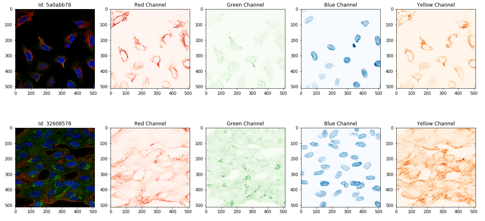

#### 图片数据预览

```python
# 定义RGBY图片读取函数
def open_rgby(path, id, size=None): #a function that reads RGBY image
    colors = ['red','green','blue','yellow']
    flags = cv2.IMREAD_GRAYSCALE
    if size is None:
        img = [cv2.imread(os.path.join(path, id+'_'+color+'.png'), flags).astype(np.float32)/255 
               for color in colors]
    else:
        img = []
        for color in colors:
            src_img = cv2.imread(os.path.join(path, id+'_'+color+'.png'), flags)
            tar_img = cv2.resize(src_img, (size, size), interpolation=cv2.INTER_CUBIC).astype(np.float32)/255
            img.append(tar_img)

    return np.stack(img, axis=0)
```

设置分行展示图片

```python
def make_image_row(image, subax, title):
    subax[0].imshow(np.stack(image, axis=-1)[:,:,:3])
    subax[0].set_title('Id: '+title)
    subax[1].imshow(image[0], cmap="Reds")
    subax[1].set_title("Red Channel")
    subax[2].imshow(image[1], cmap="Greens")
    subax[2].set_title("Green Channel")
    subax[3].imshow(image[2], cmap="Blues")
    subax[3].set_title("Blue Channel")
    subax[4].imshow(image[3], cmap="Oranges")
    subax[4].set_title("Yellow Channel")
    return subax
```


**调用方式：**

```
#设置需要展示的行数
N_SAMPLES = 3
#从数据集中随机取出NSAMPLES个Id
samples = np.array(train_df.sample(N_SAMPLES)['Id'])


fig, ax = plt.subplots(N_SAMPLES,5,figsize=(20,5*N_SAMPLES))
if ax.shape == (N_SAMPLES,):
    ax = ax.reshape(1,-1)
for n in range(N_SAMPLES):
    make_image_row(open_rgby(TRAIN, samples[n]), ax[n], samples[n].split('-')[0])
```

显示效果:



 	