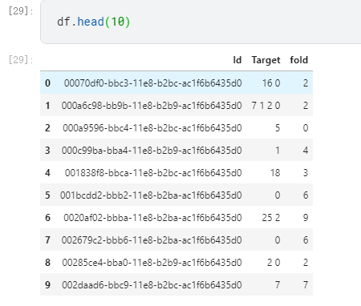

## KFold和StratifiedKFold

首先这两个函数都是sklearn模块中的，在应用之前应该导入：

```python
from sklearn.model_selection import  StratifiedKFold,KFold
```

StratifiedKFold函数采用分层划分的方法（分层随机抽样思想），验证集中不同类别占比与原始样本的比例保持一致，故StratifiedKFold在做划分的时候需要传入标签特征。


二者输入的参数也不相同

```python
class sklearn.model_selection.KFold(n_splits=5, *, shuffle=False, random_state=None)
```

- n_splits:划分后集合的数量
- shuffle:划分前数据时候被混合
- random_state:随机种子


```python
class sklearn.model_selection.StratifiedKFold(n_splits=5, *, shuffle=False, random_state=None)
```

参数和KFold一致


首先为数据集进行Fold划分，为分组打上标签

需要划分的数据集为df,分类的标签为['Target']

```python
# Fold划分
n_folds = 10
fold_cls_counts = defaultdict(int)
folds = [-1] * len(df)
for item in tqdm(df.sample(frac=True, random_state=42).itertuples(),total=len(df)):
    cls = min(item.Target.split(), key=lambda cls: cls_counts[cls])
    fold_counts = [(f, fold_cls_counts[f, cls]) for f in range(n_folds)]
    min_count = min([count for _, count in fold_counts])
    random.seed(item.Index)
    fold = random.choice([f for f, count in fold_counts if count == min_count])
    folds[item.Index] = fold
    for cls in item.Target.split():
        fold_cls_counts[fold, cls] += 1
df['fold'] = folds
```

得到的结果为:




