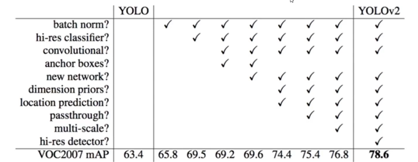
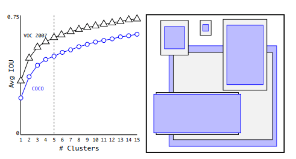
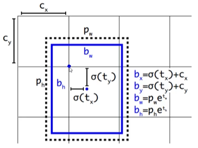
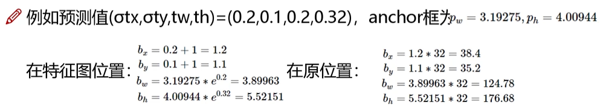
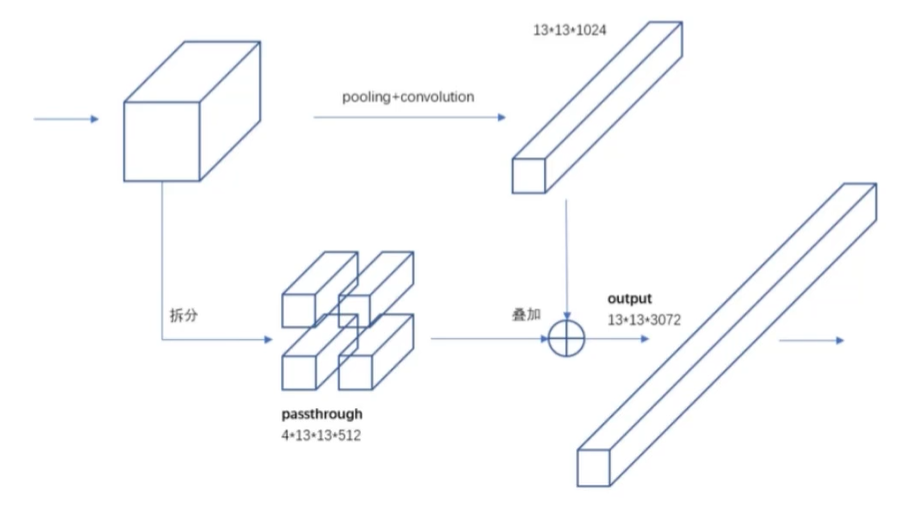
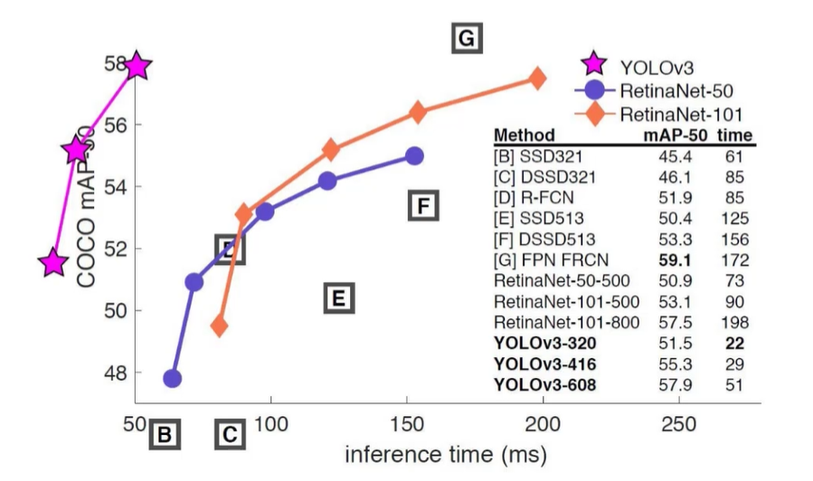
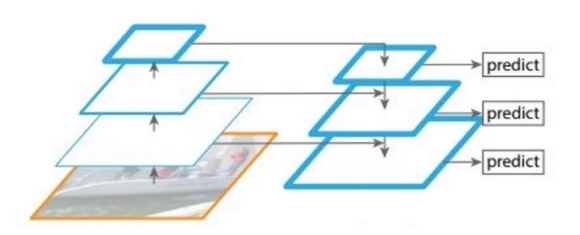

# 各种YOLO算法

[Toc]

### Yolo v1

### Yolo v2

#### V2中的聚类提取先验框

faster-rcnn中的先验框比例一般都是常规固定的，很明显这是一种空间换时间的方法，而且不一定都能够适合所有的算法

yolo v2使用K-means聚类的方法找到最适合的anchor尺寸,使用定义的距离：
$$
d(bos,centroids) = 1 - IOU(box,centroids)
$$
下图展示了聚类的簇的个数和IOU之间的关系，两条曲线分别代表了VOC和COCO数据集的测试结果。最后结合不同的K值对召回率的影响，论文选择了K=5。右边的示意图是选出来的5个box的大小，这里紫色和黑色也是分别表示两个不同的数据集，可以看出其基本形状是类似的。而且发现聚类的结果和手动设置的anchor b ox大小差别显著。聚类的结果中多是高瘦的box，而矮胖的box数量较少，这也比较符合数据集中目标的视觉效果。

#### 偏移量的计算

#### v2 特征融合

最后一层的感受野太大了，小目标可能会丢失，所以会融合之前的特征

 

### Yolo v3

v3中最大的改进就是网络结构，使其更加适合进行小目标的检测

Yolo v3采用三种不同尺寸的采样方式，例如假设图像的尺寸为416\*416，得到的特征映射为13\*13的大小，这里使用1\*1的检测核，为我们提供13\*13\*255的检测特征映射。接下来2倍上采样增加到26×26的维度。

13 x 13层负责检测大型目标对象，而52 x 52层检测较小的目标对象，26 x 26层检测中等大小目标对象。大概的融合流程如下：

####  残差连接

