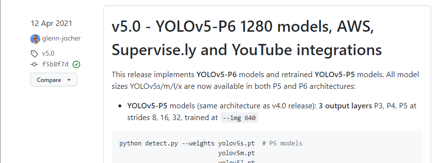
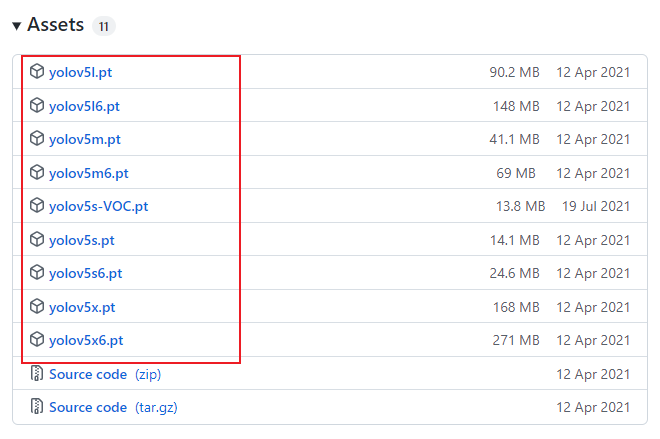
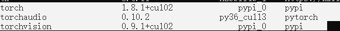
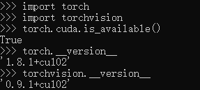

## 1.报错1

**报错信息**

```shell
Can't get attribute 'SPPF' on <module 'models.common' from 'D:\\Pycharm\\Code\\yolov5-5.0\\models\\common.py'>
```

**解决方案**

这个是因为下载的如果是YOLOV5 5.0版本的源代码漏掉了这个SPPF的函数，只要把以下的代码复制粘贴进model/common.py中即可

```python
import warnings
class SPPF(nn.Module):
    # Spatial Pyramid Pooling - Fast (SPPF) layer for YOLOv5 by Glenn Jocher
    def __init__(self, c1, c2, k=5):  # equivalent to SPP(k=(5, 9, 13))
        super().__init__()
        c_ = c1 // 2  # hidden channels
        self.cv1 = Conv(c1, c_, 1, 1)
        self.cv2 = Conv(c_ * 4, c2, 1, 1)
        self.m = nn.MaxPool2d(kernel_size=k, stride=1, padding=k // 2)

    def forward(self, x):
        x = self.cv1(x)
        with warnings.catch_warnings():
            warnings.simplefilter('ignore')  # suppress torch 1.9.0 max_pool2d() warning
            y1 = self.m(x)
            y2 = self.m(y1)
            return self.cv2(torch.cat([x, y1, y2, self.m(y2)], 1))

```


## 2.报错2

**报错信息**

```shell
RuntimeError: The size of tensor a (80) must match the size of tensor b (56) at non-singleton
```

这个是因为缺少了运行的预先连模型，打开detect.py，观察weight超参数他已经给你预定义好使用yolov5s.pt这个文件

如果目录下已经有了这个文件但是还是报错了，那就说明是版本错误，自动下载的权重文件是yolov5 6.1版本的（最新版本），这个时候就需要到官网下载你当前版本对应的那个模型文件。

[Releases · ultralytics/yolov5 (github.com)](https://github.com/ultralytics/yolov5/releases)

比如我的yolov5是5.0版本的，首先我要找到这个地方：



然后拉到这个模块最底下的Assets，直接点击需要的权重文件下载使用就好了。




## 3.报错3

```shell
RuntimeError: Couldn't load custom C++ ops. This can happen if your PyTorch and torchvision versions are incompatible, or if you had errors while compiling tor
chvision from source. For further information on the compatible versions, check https://github.com/pytorch/vision#installation for the compatibility matrix. Please check your PyTorch version with torch.__version__ and your torchvision version with torchvision.__version__ and verify if they are compatible, and if not 
please reinstall torchvision so that it matches your PyTorch install.

```

这里的问题写的很清楚了，是由于Pytorch的版本问题导致无法运行，上面给的网址有需要对应的版本：

| `torch`            | `torchvision`      | `python`                  |
| ------------------ | ------------------ | ------------------------- |
| `main` / `nightly` | `main` / `nightly` | `>=3.7`, `<=3.10`         |
| `1.11.0`           | `0.12.0`           | `>=3.7`, `<=3.10`         |
| `1.10.2`           | `0.11.3`           | `>=3.6`, `<=3.9`          |
| `1.10.1`           | `0.11.2`           | `>=3.6`, `<=3.9`          |
| `1.10.0`           | `0.11.1`           | `>=3.6`, `<=3.9`          |
| `1.9.1`            | `0.10.1`           | `>=3.6`, `<=3.9`          |
| `1.9.0`            | `0.10.0`           | `>=3.6`, `<=3.9`          |
| `1.8.2`            | `0.9.2`            | `>=3.6`, `<=3.9`          |
| `1.8.1`            | `0.9.1`            | `>=3.6`, `<=3.9`          |
| `1.8.0`            | `0.9.0`            | `>=3.6`, `<=3.9`          |
| `1.7.1`            | `0.8.2`            | `>=3.6`, `<=3.9`          |
| `1.7.0`            | `0.8.1`            | `>=3.6`, `<=3.8`          |
| `1.7.0`            | `0.8.0`            | `>=3.6`, `<=3.8`          |
| `1.6.0`            | `0.7.0`            | `>=3.6`, `<=3.8`          |
| `1.5.1`            | `0.6.1`            | `>=3.5`, `<=3.8`          |
| `1.5.0`            | `0.6.0`            | `>=3.5`, `<=3.8`          |
| `1.4.0`            | `0.5.0`            | `==2.7`, `>=3.5`, `<=3.8` |
| `1.3.1`            | `0.4.2`            | `==2.7`, `>=3.5`, `<=3.7` |
| `1.3.0`            | `0.4.1`            | `==2.7`, `>=3.5`, `<=3.7` |
| `1.2.0`            | `0.4.0`            | `==2.7`, `>=3.5`, `<=3.7` |
| `1.1.0`            | `0.3.0`            | `==2.7`, `>=3.5`, `<=3.7` |
| `<=1.0.1`          | `0.2.2`            | `==2.7`, `>=3.5`, `<=3.7` |

最好是去pytorch官网找到对应的cuda版本直接进行安装，当然也可以手动下载whl文件自己进行安装。

需要注意的是，如果安装的是gpu版本的pytorch，那就要确保torch和torchvision这两个包都是以上对应的gpu版本（例如我的环境cuda是10.2，python为3.6，那么我的torch应该是1.8.1+cu102，torchvision为0.9.1+cu102，torchauudio版本不对问题不大，主要是这两个包的版本要装对）



安装完成之后一定要确定gpu是在线的，只要是true那就万事大吉：

```python
import torch
print(torch.cuda.is_available())
```

