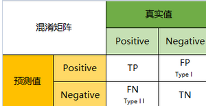
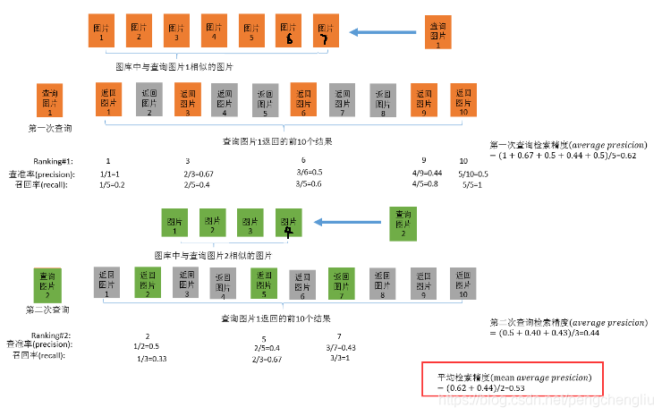
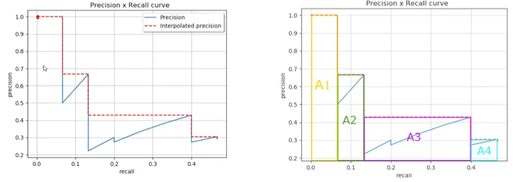
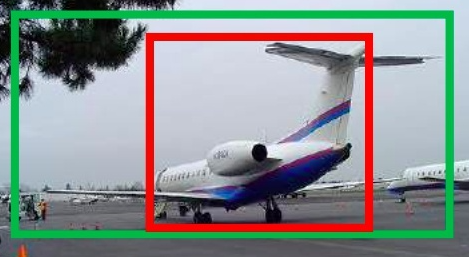
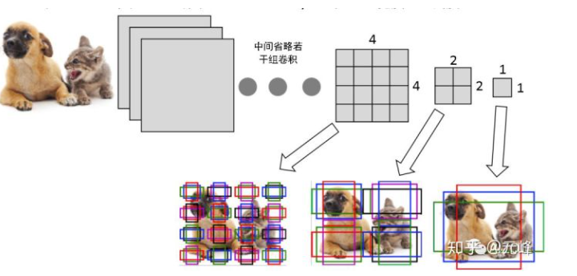
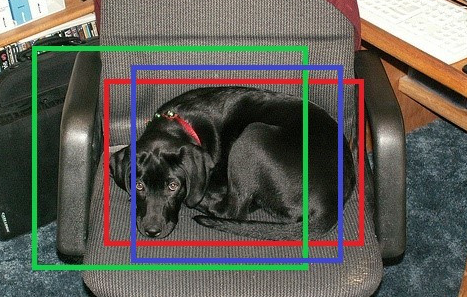
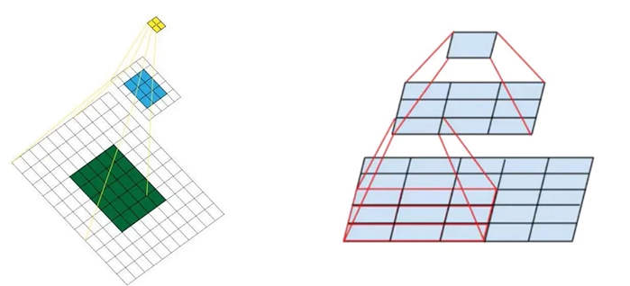

[Toc]

## 基本指标

### 混淆矩阵

- 真实值是positive，模型认为是positive的数量（True Positive=TP）
- 真实值是positive，模型认为是negative的数量（False Negative=FN）：这就是统计学上的第二类错误（Type II Error）
- 真实值是negative，模型认为是positive的数量（False Positive=FP）：这就是统计学上的第一类错误（Type I Error）
- 真实值是negative，模型认为是negative的数量（True Negative=TN）

#### Recall

recall代表的是召回率，就是“真实为正例的那些数据里预测正确的数据个数”。

$$
recall = \frac{TP}{TP+FN}
$$

#### Precision

precision代表精确率，就是“预测为正例的那些数据里预测正确的数据个数”。

$$
precision= \frac{TP}{TP+FP}
$$

### IoU

**IoU**(Intersection over Union)，即交并比，是目标检测中常见的评价标准，主要是衡量模型生成的bounding box和ground truth box之间的重叠程度，计算公式为：

简单来说就是两个BBOX相交的部分除以总面积 ($ \frac{I}{A+B} $)

### mAP

**mAP**全称是mean Average Precision，这里的Average Precision，是在不同recall下计算得到的。

在每一种阈值下（针对于置信度confidence）会有不同的精度与召回率，这样我们汇总于一张PR图：

以当前最大值作为每一个类别的高，这样就变成右图那样，所有的A面积累积起来就是mAP

最理想的情况就是只有一个类别，并且刚好覆盖精度与召回率，从这里可以看出来mAP的意义就是为了综合考虑所有的精度与召回率。

## 基本概念

### Bounding Box Regression

Regression(回归)代表对大量数据进行统计，并确定自变量于因变量相关的关系建立回归方程

在目标检测中检测是用方框作为自变量与因变量，例如下图，在通常情况下模型预测到的框是绿色框。但是由于绿色框不准，相当于没有正确的检测出飞机。所以我们希望有一个方法对绿色框进行调整，使得绿色框更接近红色。

首先对于每个方框都有四个参数 $ [x,y,w,h] $，分别代表中心点坐标，方框的宽高

 那么要经过怎么样的调整才能使得绿框变成红框呢？目标检测中的做法是：平移+缩放。

1. 将预测框的中心点平移到与真实框的中心重合的位置。

   $$
   G_{x}^{'} = P_{w}d_{x}(P) + P_{x}(1) \\
   G_{y}^{'} = P_{h}d_{y}(P) + P_{y}(2)
   $$
   
2. 将预测框的高和宽缩小或放大到与真实框一样的长度。

$$
G_{x}^{'} = P_{w}exp(d_{x}(P)) + P_{x}(1) \\
G_{y}^{'} = P_{h}exp(d_{y}(P)) + P_{y}(2)
$$

所以我们只需要计算出x,y,w,h的平移缩放两就能够找到对应的缩放关系

### 先验框（Anchor）

用一句话概括——**就是在图像上预设好的不同大小，不同长宽比的参照框。**（其实非常类似于上面的滑窗法所设置的窗口大小）

这里放一张套娃图片

经过不同尺寸的下采样，能够获得不同数量的特征图片，然后在每个特征图上使用不同长宽的bbox作为anchor。从这里也可以看出来目标检测网络上会存在很多数量的anchor，所以这里我们会使用神经网络强大的拟合能力。神经网络的输出，也就是每个anchor认为自己是否含有物体的概率，物体中心点与anchor自身的中心点位置的偏移量，以及相对于anchor宽高的比例。

例如上图的蓝色为先验框，这个anchor代表的狗子概率比较大，这样之后模型生成的绿框的系数都会像这个蓝框逼近（使用之前提到的平移量以及缩放量）

#### 感受野

简单来说就是特征图上的点能看到原始图像上多大的区域

越大的感受野越能考虑全局的特征

