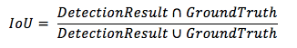
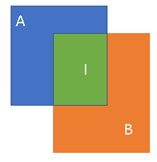

[Toc]

## 基本指标

### IoU

**IoU**(Intersection over Union)，即交并比，是目标检测中常见的评价标准，主要是衡量模型生成的bounding box和ground truth box之间的重叠程度，计算公式为：

简单来说就是两个BBOX相交的部分除以总面积 ($ \frac{I}{A+B} $)

## 基本概念

### Bounding Box Regression

### 先验框（Anchor）

