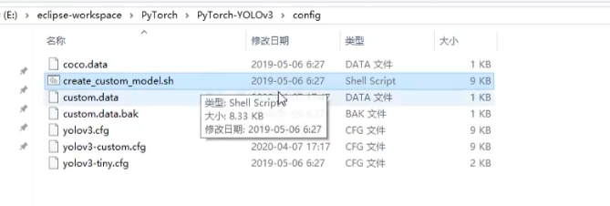

图像数据常用标注软件为Labelme

github下载网址：[wkentaro/labelme: Image Polygonal Annotation with Python (polygon, rectangle, circle, line, point and image-level flag annotation). (github.com)](https://github.com/wkentaro/labelme)


**创建环境**

```python
# windows安装首先使用conda创建虚拟环境
conda create --name=labelme python=3
conda activate labelme
pip install labelme
```


**常用指令**

```shell
labelme  # 打开labelme软件

labelme apc2016_obj3.jpg  # 指定图像文件
labelme apc2016_obj3.jpg -O apc2016_obj3.json  # 保存后关闭labelme
labelme apc2016_obj3.jpg --nodata  # JSON文件不包含图像数据，而包含图像的相对路径
labelme apc2016_obj3.jpg \
  --labels highland_6539_self_stick_notes,mead_index_cards,kong_air_dog_squeakair_tennis_ball  # 指定 label list

labelme data_annotated/  # 指定图像文件夹
labelme data_annotated/ --labels labels.txt  # 使用文件指定 label list
```


**使用界面**

左边那一列为工具栏


打开图片：


创建标注区域


例如这里直接使用多边形标注并且创建分类mask：


或者可以使用特殊大小的框进行标注：


点击save会生成一堆json文件


**创建自定义训练脚本**

yolov3文件夹中自带一个创建脚本



使用命令

```bash
bash create_custom_mode.sh 训练的分类数目
```

之后会自动生成一个config的json脚本用于训练


**标签格式转换**

使用labelme得到的标注数据为x1,x2,y1,y2， 

但是在YOLOV3中，使用的格式为Cx,Cy,WH, 所以首先需要进行一定的转换

```python
# 制作标签
from PIL import Image,ImageDraw

anno_box_path = r"D:/AIstudyCode/data/CelebA/Anno/list_bbox_celeba.txt"
label_dir = "D:/AIstudyCode/data/CelebA/labels"
img_dir = "D:/AIstudyCode/data/CelebA/Img/img_celeba.7z/img_celeba.7z/img_celeba"
count = 0
epoch = 1
box_file = open(anno_box_path,"r")

i = 0


for line in box_file:
    if i < 2:
        i += 1
        continue
    i += 1
    print(line)

    imgname = line[0:6]
    #print(imgname)

    img_strs = line.split()
    x1, y1, w, h = int(img_strs[1]), int(img_strs[2]), int(img_strs[3]), int(img_strs[4])
    x2, y2 = x1+w, y1+h

    img = Image.open(f"{img_dir}/{img_strs[0]}")
    img_w, img_h = img.size

    # ****************************
    dw = 1. / (int(img_w))
    dh = 1. / (int(img_h))
    x = ((x1 + x2) / 2.0 - 1)*dw
    y = ((y1 + y2) / 2.0 - 1)*dh
    w = (x2 - x1)*dw
    h = (y2 - y1)*dh
    # x = x * dw
    # w = w * dw
    # y = y * dh
    # h = h * dh
    # ****************************
    label_txt = open(f"{label_dir}/{imgname}.txt", "w")

    label_txt.write(f"0 {x} {y} {w} {h}\n")
    label_txt.flush()
    label_txt.close()

    if i == 1562:
        exit()
```

